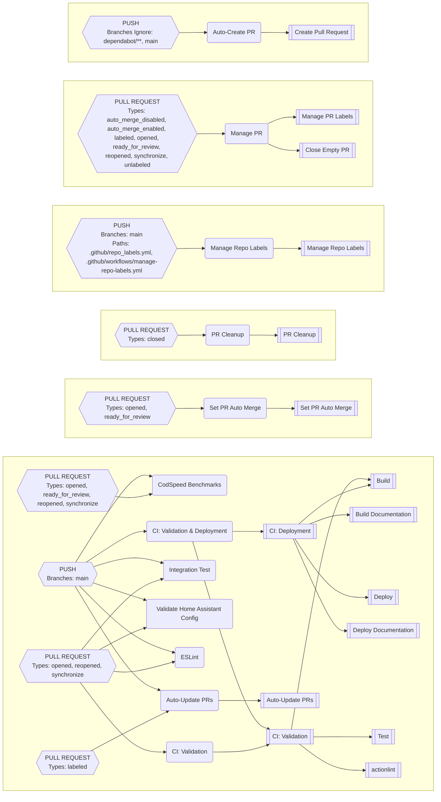

# GitHub Config Files

## Repository File Mappings

### All Mappings

| Destination | [addon-item-warehouse-api](https://github.com/worgarside/addon-item-warehouse-api) | [addon-item-warehouse-website](https://github.com/worgarside/addon-item-warehouse-website) | [addon-yas-209-bridge](https://github.com/worgarside/addon-yas-209-bridge) | [esphome](https://github.com/worgarside/esphome) | [home-assistant](https://github.com/worgarside/home-assistant) | [home-assistant-appdaemon](https://github.com/worgarside/home-assistant-appdaemon) | [home-assistant-config-validator](https://github.com/worgarside/home-assistant-config-validator) | [led-matrix-controller](https://github.com/worgarside/led-matrix-controller) | [plant-monitor](https://github.com/worgarside/plant-monitor) | [pre-commit-hooks-dependency-sync](https://github.com/worgarside/pre-commit-hooks-dependency-sync) | [python-template](https://github.com/worgarside/python-template) | [smart-mini-crt-interface](https://github.com/worgarside/smart-mini-crt-interface) | [very-slow-movie-player](https://github.com/worgarside/very-slow-movie-player) | [wg-scripts](https://github.com/worgarside/wg-scripts) | [wg-utilities](https://github.com/worgarside/wg-utilities) |
|-------------|--------|--------|--------|--------|--------|--------|--------|--------|--------|--------|--------|--------|--------|--------|--------|
| **.github/CODEOWNERS** | [.github/CODEOWNERS](.github/CODEOWNERS) | [.github/CODEOWNERS](.github/CODEOWNERS) | [.github/CODEOWNERS](.github/CODEOWNERS) | [.github/CODEOWNERS](.github/CODEOWNERS) | [.github/CODEOWNERS](.github/CODEOWNERS) | [.github/CODEOWNERS](.github/CODEOWNERS) | [.github/CODEOWNERS](.github/CODEOWNERS) | [.github/CODEOWNERS](.github/CODEOWNERS) | [.github/CODEOWNERS](.github/CODEOWNERS) | [.github/CODEOWNERS](.github/CODEOWNERS) | [.github/CODEOWNERS](.github/CODEOWNERS) | [.github/CODEOWNERS](.github/CODEOWNERS) | [.github/CODEOWNERS](.github/CODEOWNERS) | [.github/CODEOWNERS](.github/CODEOWNERS) | [.github/CODEOWNERS](.github/CODEOWNERS) |
| **.github/dependabot.yml** | [.github/dependabot.yml](.github/dependabot.yml) | [.github/dependabot.yml](.github/dependabot.yml) | [.github/dependabot.yml](.github/dependabot.yml) | [.github/dependabot.yml](.github/dependabot.yml) | [.github/dependabot.yml](.github/dependabot.yml) | [.github/dependabot.yml](.github/dependabot.yml) | [.github/dependabot.yml](.github/dependabot.yml) | [.github/dependabot.yml](.github/dependabot.yml) | [.github/dependabot.yml](.github/dependabot.yml) | [.github/dependabot.yml](.github/dependabot.yml) | [.github/dependabot.yml](.github/dependabot.yml) | [.github/dependabot.yml](.github/dependabot.yml) | [.github/dependabot.yml](.github/dependabot.yml) | [.github/dependabot.yml](.github/dependabot.yml) | [.github/dependabot.yml](.github/dependabot.yml) |
| **.github/labeler.yml** | [.github/labeler.yml](.github/labeler.yml) | [.github/labeler.yml](.github/labeler.yml) | [.github/labeler.yml](.github/labeler.yml) | [.github/labeler.yml](.github/labeler.yml) | | [.github/labeler.yml](.github/labeler.yml) | [.github/labeler.yml](.github/labeler.yml) | [.github/labeler.yml](.github/labeler.yml) | [.github/labeler.yml](.github/labeler.yml) | [.github/labeler.yml](.github/labeler.yml) | [.github/labeler.yml](.github/labeler.yml) | [.github/labeler.yml](.github/labeler.yml) | [.github/labeler.yml](.github/labeler.yml) | [.github/labeler.yml](.github/labeler.yml) | [.github/labeler.yml](.github/labeler.yml) |
| **.github/release-drafter.yml** | [gha_sync/configs/release-drafter.yml](gha_sync/configs/release-drafter.yml) | [gha_sync/configs/release-drafter.yml](gha_sync/configs/release-drafter.yml) | [gha_sync/configs/release-drafter.yml](gha_sync/configs/release-drafter.yml) | [gha_sync/configs/release-drafter.yml](gha_sync/configs/release-drafter.yml) | [gha_sync/configs/release-drafter.yml](gha_sync/configs/release-drafter.yml) | [gha_sync/configs/release-drafter.yml](gha_sync/configs/release-drafter.yml) | [gha_sync/configs/release-drafter.yml](gha_sync/configs/release-drafter.yml) | [gha_sync/configs/release-drafter.yml](gha_sync/configs/release-drafter.yml) | [gha_sync/configs/release-drafter.yml](gha_sync/configs/release-drafter.yml) | [gha_sync/configs/release-drafter.yml](gha_sync/configs/release-drafter.yml) | [gha_sync/configs/release-drafter.yml](gha_sync/configs/release-drafter.yml) | [gha_sync/configs/release-drafter.yml](gha_sync/configs/release-drafter.yml) | [gha_sync/configs/release-drafter.yml](gha_sync/configs/release-drafter.yml) | [gha_sync/configs/release-drafter.yml](gha_sync/configs/release-drafter.yml) | [gha_sync/configs/release-drafter.yml](gha_sync/configs/release-drafter.yml) |
| **.github/repo_labels.yml** | [.github/repo_labels.yml](.github/repo_labels.yml) | [.github/repo_labels.yml](.github/repo_labels.yml) | [.github/repo_labels.yml](.github/repo_labels.yml) | [.github/repo_labels.yml](.github/repo_labels.yml) | | [.github/repo_labels.yml](.github/repo_labels.yml) | [.github/repo_labels.yml](.github/repo_labels.yml) | [.github/repo_labels.yml](.github/repo_labels.yml) | [.github/repo_labels.yml](.github/repo_labels.yml) | [.github/repo_labels.yml](.github/repo_labels.yml) | [.github/repo_labels.yml](.github/repo_labels.yml) | [.github/repo_labels.yml](.github/repo_labels.yml) | [.github/repo_labels.yml](.github/repo_labels.yml) | [.github/repo_labels.yml](.github/repo_labels.yml) | [.github/repo_labels.yml](.github/repo_labels.yml) |
| **.github/workflows/auto-create-pr.yml** | [gha_sync/workflows/all/auto-create-pr.yml](gha_sync/workflows/all/auto-create-pr.yml) | [gha_sync/workflows/all/auto-create-pr.yml](gha_sync/workflows/all/auto-create-pr.yml) | [gha_sync/workflows/all/auto-create-pr.yml](gha_sync/workflows/all/auto-create-pr.yml) | [gha_sync/workflows/all/auto-create-pr.yml](gha_sync/workflows/all/auto-create-pr.yml) | [gha_sync/workflows/all/auto-create-pr.yml](gha_sync/workflows/all/auto-create-pr.yml) | [gha_sync/workflows/all/auto-create-pr.yml](gha_sync/workflows/all/auto-create-pr.yml) | [gha_sync/workflows/all/auto-create-pr.yml](gha_sync/workflows/all/auto-create-pr.yml) | [gha_sync/workflows/all/auto-create-pr.yml](gha_sync/workflows/all/auto-create-pr.yml) | [gha_sync/workflows/all/auto-create-pr.yml](gha_sync/workflows/all/auto-create-pr.yml) | [gha_sync/workflows/all/auto-create-pr.yml](gha_sync/workflows/all/auto-create-pr.yml) | [gha_sync/workflows/all/auto-create-pr.yml](gha_sync/workflows/all/auto-create-pr.yml) | [gha_sync/workflows/all/auto-create-pr.yml](gha_sync/workflows/all/auto-create-pr.yml) | [gha_sync/workflows/all/auto-create-pr.yml](gha_sync/workflows/all/auto-create-pr.yml) | [gha_sync/workflows/all/auto-create-pr.yml](gha_sync/workflows/all/auto-create-pr.yml) | [gha_sync/workflows/all/auto-create-pr.yml](gha_sync/workflows/all/auto-create-pr.yml) |
| **.github/workflows/ci_deployment.yml** | [gha_sync/workflows/template/ci_deployment.template.yml](gha_sync/workflows/template/ci_deployment.template.yml) | [gha_sync/workflows/template/ci_deployment.template.yml](gha_sync/workflows/template/ci_deployment.template.yml) | [gha_sync/workflows/template/ci_deployment.template.yml](gha_sync/workflows/template/ci_deployment.template.yml) | [gha_sync/workflows/template/ci_deployment.template.yml](gha_sync/workflows/template/ci_deployment.template.yml) | [gha_sync/workflows/template/ci_deployment.template.yml](gha_sync/workflows/template/ci_deployment.template.yml) | [gha_sync/workflows/template/ci_deployment.template.yml](gha_sync/workflows/template/ci_deployment.template.yml) | [gha_sync/workflows/template/ci_deployment.template.yml](gha_sync/workflows/template/ci_deployment.template.yml) | [gha_sync/workflows/template/ci_deployment.template.yml](gha_sync/workflows/template/ci_deployment.template.yml) | [gha_sync/workflows/template/ci_deployment.template.yml](gha_sync/workflows/template/ci_deployment.template.yml) | [gha_sync/workflows/template/ci_deployment.template.yml](gha_sync/workflows/template/ci_deployment.template.yml) | [gha_sync/workflows/template/ci_deployment.template.yml](gha_sync/workflows/template/ci_deployment.template.yml) | [gha_sync/workflows/template/ci_deployment.template.yml](gha_sync/workflows/template/ci_deployment.template.yml) | [gha_sync/workflows/template/ci_deployment.template.yml](gha_sync/workflows/template/ci_deployment.template.yml) | [gha_sync/workflows/template/ci_deployment.template.yml](gha_sync/workflows/template/ci_deployment.template.yml) | [gha_sync/workflows/template/ci_deployment.template.yml](gha_sync/workflows/template/ci_deployment.template.yml) |
| **.github/workflows/ci_validation.yml** | [gha_sync/workflows/template/ci_validation.template.yml](gha_sync/workflows/template/ci_validation.template.yml) | [gha_sync/workflows/template/ci_validation.template.yml](gha_sync/workflows/template/ci_validation.template.yml) | [gha_sync/workflows/template/ci_validation.template.yml](gha_sync/workflows/template/ci_validation.template.yml) | | [gha_sync/workflows/template/ci_validation.template.yml](gha_sync/workflows/template/ci_validation.template.yml) | [gha_sync/workflows/template/ci_validation.template.yml](gha_sync/workflows/template/ci_validation.template.yml) | [gha_sync/workflows/template/ci_validation.template.yml](gha_sync/workflows/template/ci_validation.template.yml) | [gha_sync/workflows/template/ci_validation.template.yml](gha_sync/workflows/template/ci_validation.template.yml) | [gha_sync/workflows/template/ci_validation.template.yml](gha_sync/workflows/template/ci_validation.template.yml) | [gha_sync/workflows/template/ci_validation.template.yml](gha_sync/workflows/template/ci_validation.template.yml) | [gha_sync/workflows/template/ci_validation.template.yml](gha_sync/workflows/template/ci_validation.template.yml) | [gha_sync/workflows/template/ci_validation.template.yml](gha_sync/workflows/template/ci_validation.template.yml) | [gha_sync/workflows/template/ci_validation.template.yml](gha_sync/workflows/template/ci_validation.template.yml) | [gha_sync/workflows/template/ci_validation.template.yml](gha_sync/workflows/template/ci_validation.template.yml) | [gha_sync/workflows/template/ci_validation.template.yml](gha_sync/workflows/template/ci_validation.template.yml) |
| **.github/workflows/codspeed.yml** | | | | | | | [gha_sync/workflows/template/codspeed.template.yml](gha_sync/workflows/template/codspeed.template.yml) | [gha_sync/workflows/template/codspeed.template.yml](gha_sync/workflows/template/codspeed.template.yml) | | | | | | | |
| **.github/workflows/eslint.yml** | | [gha_sync/workflows/repo/addon-item-warehouse-website/eslint.yml](gha_sync/workflows/repo/addon-item-warehouse-website/eslint.yml) | | | | | | | | | | | | | |
| **.github/workflows/integration-test.yml** | | | | | | | [gha_sync/workflows/repo/home-assistant-config-validator/integration-test.yml](gha_sync/workflows/repo/home-assistant-config-validator/integration-test.yml) | | | | | | | | |
| **.github/workflows/manage-pr.yml** | [gha_sync/workflows/all/manage-pr.yml](gha_sync/workflows/all/manage-pr.yml) | [gha_sync/workflows/all/manage-pr.yml](gha_sync/workflows/all/manage-pr.yml) | [gha_sync/workflows/all/manage-pr.yml](gha_sync/workflows/all/manage-pr.yml) | [gha_sync/workflows/all/manage-pr.yml](gha_sync/workflows/all/manage-pr.yml) | [gha_sync/workflows/all/manage-pr.yml](gha_sync/workflows/all/manage-pr.yml) | [gha_sync/workflows/all/manage-pr.yml](gha_sync/workflows/all/manage-pr.yml) | [gha_sync/workflows/all/manage-pr.yml](gha_sync/workflows/all/manage-pr.yml) | [gha_sync/workflows/all/manage-pr.yml](gha_sync/workflows/all/manage-pr.yml) | [gha_sync/workflows/all/manage-pr.yml](gha_sync/workflows/all/manage-pr.yml) | [gha_sync/workflows/all/manage-pr.yml](gha_sync/workflows/all/manage-pr.yml) | [gha_sync/workflows/all/manage-pr.yml](gha_sync/workflows/all/manage-pr.yml) | [gha_sync/workflows/all/manage-pr.yml](gha_sync/workflows/all/manage-pr.yml) | [gha_sync/workflows/all/manage-pr.yml](gha_sync/workflows/all/manage-pr.yml) | [gha_sync/workflows/all/manage-pr.yml](gha_sync/workflows/all/manage-pr.yml) | [gha_sync/workflows/all/manage-pr.yml](gha_sync/workflows/all/manage-pr.yml) |
| **.github/workflows/manage-repo-labels.yml** | [gha_sync/workflows/all/manage-repo-labels.yml](gha_sync/workflows/all/manage-repo-labels.yml) | [gha_sync/workflows/all/manage-repo-labels.yml](gha_sync/workflows/all/manage-repo-labels.yml) | [gha_sync/workflows/all/manage-repo-labels.yml](gha_sync/workflows/all/manage-repo-labels.yml) | [gha_sync/workflows/all/manage-repo-labels.yml](gha_sync/workflows/all/manage-repo-labels.yml) | [gha_sync/workflows/all/manage-repo-labels.yml](gha_sync/workflows/all/manage-repo-labels.yml) | [gha_sync/workflows/all/manage-repo-labels.yml](gha_sync/workflows/all/manage-repo-labels.yml) | [gha_sync/workflows/all/manage-repo-labels.yml](gha_sync/workflows/all/manage-repo-labels.yml) | [gha_sync/workflows/all/manage-repo-labels.yml](gha_sync/workflows/all/manage-repo-labels.yml) | [gha_sync/workflows/all/manage-repo-labels.yml](gha_sync/workflows/all/manage-repo-labels.yml) | [gha_sync/workflows/all/manage-repo-labels.yml](gha_sync/workflows/all/manage-repo-labels.yml) | [gha_sync/workflows/all/manage-repo-labels.yml](gha_sync/workflows/all/manage-repo-labels.yml) | [gha_sync/workflows/all/manage-repo-labels.yml](gha_sync/workflows/all/manage-repo-labels.yml) | [gha_sync/workflows/all/manage-repo-labels.yml](gha_sync/workflows/all/manage-repo-labels.yml) | [gha_sync/workflows/all/manage-repo-labels.yml](gha_sync/workflows/all/manage-repo-labels.yml) | [gha_sync/workflows/all/manage-repo-labels.yml](gha_sync/workflows/all/manage-repo-labels.yml) |
| **.github/workflows/pr-autoupdate.yml** | [gha_sync/workflows/all/pr-autoupdate.yml](gha_sync/workflows/all/pr-autoupdate.yml) | [gha_sync/workflows/all/pr-autoupdate.yml](gha_sync/workflows/all/pr-autoupdate.yml) | [gha_sync/workflows/all/pr-autoupdate.yml](gha_sync/workflows/all/pr-autoupdate.yml) | [gha_sync/workflows/all/pr-autoupdate.yml](gha_sync/workflows/all/pr-autoupdate.yml) | [gha_sync/workflows/all/pr-autoupdate.yml](gha_sync/workflows/all/pr-autoupdate.yml) | [gha_sync/workflows/all/pr-autoupdate.yml](gha_sync/workflows/all/pr-autoupdate.yml) | [gha_sync/workflows/all/pr-autoupdate.yml](gha_sync/workflows/all/pr-autoupdate.yml) | [gha_sync/workflows/all/pr-autoupdate.yml](gha_sync/workflows/all/pr-autoupdate.yml) | [gha_sync/workflows/all/pr-autoupdate.yml](gha_sync/workflows/all/pr-autoupdate.yml) | [gha_sync/workflows/all/pr-autoupdate.yml](gha_sync/workflows/all/pr-autoupdate.yml) | [gha_sync/workflows/all/pr-autoupdate.yml](gha_sync/workflows/all/pr-autoupdate.yml) | [gha_sync/workflows/all/pr-autoupdate.yml](gha_sync/workflows/all/pr-autoupdate.yml) | [gha_sync/workflows/all/pr-autoupdate.yml](gha_sync/workflows/all/pr-autoupdate.yml) | [gha_sync/workflows/all/pr-autoupdate.yml](gha_sync/workflows/all/pr-autoupdate.yml) | [gha_sync/workflows/all/pr-autoupdate.yml](gha_sync/workflows/all/pr-autoupdate.yml) |
| **.github/workflows/pr-cleanup.yml** | [gha_sync/workflows/all/pr-cleanup.yml](gha_sync/workflows/all/pr-cleanup.yml) | [gha_sync/workflows/all/pr-cleanup.yml](gha_sync/workflows/all/pr-cleanup.yml) | [gha_sync/workflows/all/pr-cleanup.yml](gha_sync/workflows/all/pr-cleanup.yml) | [gha_sync/workflows/all/pr-cleanup.yml](gha_sync/workflows/all/pr-cleanup.yml) | [gha_sync/workflows/all/pr-cleanup.yml](gha_sync/workflows/all/pr-cleanup.yml) | [gha_sync/workflows/all/pr-cleanup.yml](gha_sync/workflows/all/pr-cleanup.yml) | [gha_sync/workflows/all/pr-cleanup.yml](gha_sync/workflows/all/pr-cleanup.yml) | [gha_sync/workflows/all/pr-cleanup.yml](gha_sync/workflows/all/pr-cleanup.yml) | [gha_sync/workflows/all/pr-cleanup.yml](gha_sync/workflows/all/pr-cleanup.yml) | [gha_sync/workflows/all/pr-cleanup.yml](gha_sync/workflows/all/pr-cleanup.yml) | [gha_sync/workflows/all/pr-cleanup.yml](gha_sync/workflows/all/pr-cleanup.yml) | [gha_sync/workflows/all/pr-cleanup.yml](gha_sync/workflows/all/pr-cleanup.yml) | [gha_sync/workflows/all/pr-cleanup.yml](gha_sync/workflows/all/pr-cleanup.yml) | [gha_sync/workflows/all/pr-cleanup.yml](gha_sync/workflows/all/pr-cleanup.yml) | [gha_sync/workflows/all/pr-cleanup.yml](gha_sync/workflows/all/pr-cleanup.yml) |
| **.github/workflows/set-pr-auto-merge.yml** | [gha_sync/workflows/all/set-pr-auto-merge.yml](gha_sync/workflows/all/set-pr-auto-merge.yml) | [gha_sync/workflows/all/set-pr-auto-merge.yml](gha_sync/workflows/all/set-pr-auto-merge.yml) | [gha_sync/workflows/all/set-pr-auto-merge.yml](gha_sync/workflows/all/set-pr-auto-merge.yml) | [gha_sync/workflows/all/set-pr-auto-merge.yml](gha_sync/workflows/all/set-pr-auto-merge.yml) | [gha_sync/workflows/all/set-pr-auto-merge.yml](gha_sync/workflows/all/set-pr-auto-merge.yml) | [gha_sync/workflows/all/set-pr-auto-merge.yml](gha_sync/workflows/all/set-pr-auto-merge.yml) | [gha_sync/workflows/all/set-pr-auto-merge.yml](gha_sync/workflows/all/set-pr-auto-merge.yml) | [gha_sync/workflows/all/set-pr-auto-merge.yml](gha_sync/workflows/all/set-pr-auto-merge.yml) | [gha_sync/workflows/all/set-pr-auto-merge.yml](gha_sync/workflows/all/set-pr-auto-merge.yml) | [gha_sync/workflows/all/set-pr-auto-merge.yml](gha_sync/workflows/all/set-pr-auto-merge.yml) | [gha_sync/workflows/all/set-pr-auto-merge.yml](gha_sync/workflows/all/set-pr-auto-merge.yml) | [gha_sync/workflows/all/set-pr-auto-merge.yml](gha_sync/workflows/all/set-pr-auto-merge.yml) | [gha_sync/workflows/all/set-pr-auto-merge.yml](gha_sync/workflows/all/set-pr-auto-merge.yml) | [gha_sync/workflows/all/set-pr-auto-merge.yml](gha_sync/workflows/all/set-pr-auto-merge.yml) | [gha_sync/workflows/all/set-pr-auto-merge.yml](gha_sync/workflows/all/set-pr-auto-merge.yml) |
| **.github/workflows/validate-home-assistant-config.yml** | | | | | [gha_sync/workflows/repo/home-assistant/validate-home-assistant-config.yml](gha_sync/workflows/repo/home-assistant/validate-home-assistant-config.yml) | | | | | | | | | | |
| **.yamllint** | [.yamllint](.yamllint) | | [.yamllint](.yamllint) | [.yamllint](.yamllint) | | [.yamllint](.yamllint) | [.yamllint](.yamllint) | [.yamllint](.yamllint) | [.yamllint](.yamllint) | [.yamllint](.yamllint) | [.yamllint](.yamllint) | [.yamllint](.yamllint) | [.yamllint](.yamllint) | [.yamllint](.yamllint) | |
### Per-Repository Mappings

### [addon-item-warehouse-api](https://github.com/worgarside/addon-item-warehouse-api) (14 files)

Mapping Table

| Source | Destination |
|--------|-------------|
| [.github/CODEOWNERS](.github/CODEOWNERS) | [.github/CODEOWNERS](https://github.com/worgarside/addon-item-warehouse-api/.github/CODEOWNERS) |
| [.github/dependabot.yml](.github/dependabot.yml) | [.github/dependabot.yml](https://github.com/worgarside/addon-item-warehouse-api/.github/dependabot.yml) |
| [.github/labeler.yml](.github/labeler.yml) | [.github/labeler.yml](https://github.com/worgarside/addon-item-warehouse-api/.github/labeler.yml) |
| [.github/repo_labels.yml](.github/repo_labels.yml) | [.github/repo_labels.yml](https://github.com/worgarside/addon-item-warehouse-api/.github/repo_labels.yml) |
| [.yamllint](.yamllint) | [.yamllint](https://github.com/worgarside/addon-item-warehouse-api/.yamllint) |
| [gha_sync/configs/release-drafter.yml](gha_sync/configs/release-drafter.yml) | [.github/release-drafter.yml](https://github.com/worgarside/addon-item-warehouse-api/.github/release-drafter.yml) |
| [gha_sync/workflows/all/auto-create-pr.yml](gha_sync/workflows/all/auto-create-pr.yml) | [.github/workflows/auto-create-pr.yml](https://github.com/worgarside/addon-item-warehouse-api/.github/workflows/auto-create-pr.yml) |
| [gha_sync/workflows/all/manage-pr.yml](gha_sync/workflows/all/manage-pr.yml) | [.github/workflows/manage-pr.yml](https://github.com/worgarside/addon-item-warehouse-api/.github/workflows/manage-pr.yml) |
| [gha_sync/workflows/all/manage-repo-labels.yml](gha_sync/workflows/all/manage-repo-labels.yml) | [.github/workflows/manage-repo-labels.yml](https://github.com/worgarside/addon-item-warehouse-api/.github/workflows/manage-repo-labels.yml) |
| [gha_sync/workflows/all/pr-autoupdate.yml](gha_sync/workflows/all/pr-autoupdate.yml) | [.github/workflows/pr-autoupdate.yml](https://github.com/worgarside/addon-item-warehouse-api/.github/workflows/pr-autoupdate.yml) |
| [gha_sync/workflows/all/pr-cleanup.yml](gha_sync/workflows/all/pr-cleanup.yml) | [.github/workflows/pr-cleanup.yml](https://github.com/worgarside/addon-item-warehouse-api/.github/workflows/pr-cleanup.yml) |
| [gha_sync/workflows/all/set-pr-auto-merge.yml](gha_sync/workflows/all/set-pr-auto-merge.yml) | [.github/workflows/set-pr-auto-merge.yml](https://github.com/worgarside/addon-item-warehouse-api/.github/workflows/set-pr-auto-merge.yml) |
| [gha_sync/workflows/template/ci_deployment.template.yml](gha_sync/workflows/template/ci_deployment.template.yml) | [.github/workflows/ci_deployment.yml](https://github.com/worgarside/addon-item-warehouse-api/.github/workflows/ci_deployment.yml) |
| [gha_sync/workflows/template/ci_validation.template.yml](gha_sync/workflows/template/ci_validation.template.yml) | [.github/workflows/ci_validation.yml](https://github.com/worgarside/addon-item-warehouse-api/.github/workflows/ci_validation.yml) |

### [addon-item-warehouse-website](https://github.com/worgarside/addon-item-warehouse-website) (14 files)

Mapping Table

| Source | Destination |
|--------|-------------|
| [.github/CODEOWNERS](.github/CODEOWNERS) | [.github/CODEOWNERS](https://github.com/worgarside/addon-item-warehouse-website/.github/CODEOWNERS) |
| [.github/dependabot.yml](.github/dependabot.yml) | [.github/dependabot.yml](https://github.com/worgarside/addon-item-warehouse-website/.github/dependabot.yml) |
| [.github/labeler.yml](.github/labeler.yml) | [.github/labeler.yml](https://github.com/worgarside/addon-item-warehouse-website/.github/labeler.yml) |
| [.github/repo_labels.yml](.github/repo_labels.yml) | [.github/repo_labels.yml](https://github.com/worgarside/addon-item-warehouse-website/.github/repo_labels.yml) |
| [gha_sync/configs/release-drafter.yml](gha_sync/configs/release-drafter.yml) | [.github/release-drafter.yml](https://github.com/worgarside/addon-item-warehouse-website/.github/release-drafter.yml) |
| [gha_sync/workflows/all/auto-create-pr.yml](gha_sync/workflows/all/auto-create-pr.yml) | [.github/workflows/auto-create-pr.yml](https://github.com/worgarside/addon-item-warehouse-website/.github/workflows/auto-create-pr.yml) |
| [gha_sync/workflows/all/manage-pr.yml](gha_sync/workflows/all/manage-pr.yml) | [.github/workflows/manage-pr.yml](https://github.com/worgarside/addon-item-warehouse-website/.github/workflows/manage-pr.yml) |
| [gha_sync/workflows/all/manage-repo-labels.yml](gha_sync/workflows/all/manage-repo-labels.yml) | [.github/workflows/manage-repo-labels.yml](https://github.com/worgarside/addon-item-warehouse-website/.github/workflows/manage-repo-labels.yml) |
| [gha_sync/workflows/all/pr-autoupdate.yml](gha_sync/workflows/all/pr-autoupdate.yml) | [.github/workflows/pr-autoupdate.yml](https://github.com/worgarside/addon-item-warehouse-website/.github/workflows/pr-autoupdate.yml) |
| [gha_sync/workflows/all/pr-cleanup.yml](gha_sync/workflows/all/pr-cleanup.yml) | [.github/workflows/pr-cleanup.yml](https://github.com/worgarside/addon-item-warehouse-website/.github/workflows/pr-cleanup.yml) |
| [gha_sync/workflows/all/set-pr-auto-merge.yml](gha_sync/workflows/all/set-pr-auto-merge.yml) | [.github/workflows/set-pr-auto-merge.yml](https://github.com/worgarside/addon-item-warehouse-website/.github/workflows/set-pr-auto-merge.yml) |
| [gha_sync/workflows/repo/addon-item-warehouse-website/eslint.yml](gha_sync/workflows/repo/addon-item-warehouse-website/eslint.yml) | [.github/workflows/eslint.yml](https://github.com/worgarside/addon-item-warehouse-website/.github/workflows/eslint.yml) |
| [gha_sync/workflows/template/ci_deployment.template.yml](gha_sync/workflows/template/ci_deployment.template.yml) | [.github/workflows/ci_deployment.yml](https://github.com/worgarside/addon-item-warehouse-website/.github/workflows/ci_deployment.yml) |
| [gha_sync/workflows/template/ci_validation.template.yml](gha_sync/workflows/template/ci_validation.template.yml) | [.github/workflows/ci_validation.yml](https://github.com/worgarside/addon-item-warehouse-website/.github/workflows/ci_validation.yml) |

### [addon-yas-209-bridge](https://github.com/worgarside/addon-yas-209-bridge) (14 files)

Mapping Table

| Source | Destination |
|--------|-------------|
| [.github/CODEOWNERS](.github/CODEOWNERS) | [.github/CODEOWNERS](https://github.com/worgarside/addon-yas-209-bridge/.github/CODEOWNERS) |
| [.github/dependabot.yml](.github/dependabot.yml) | [.github/dependabot.yml](https://github.com/worgarside/addon-yas-209-bridge/.github/dependabot.yml) |
| [.github/labeler.yml](.github/labeler.yml) | [.github/labeler.yml](https://github.com/worgarside/addon-yas-209-bridge/.github/labeler.yml) |
| [.github/repo_labels.yml](.github/repo_labels.yml) | [.github/repo_labels.yml](https://github.com/worgarside/addon-yas-209-bridge/.github/repo_labels.yml) |
| [.yamllint](.yamllint) | [.yamllint](https://github.com/worgarside/addon-yas-209-bridge/.yamllint) |
| [gha_sync/configs/release-drafter.yml](gha_sync/configs/release-drafter.yml) | [.github/release-drafter.yml](https://github.com/worgarside/addon-yas-209-bridge/.github/release-drafter.yml) |
| [gha_sync/workflows/all/auto-create-pr.yml](gha_sync/workflows/all/auto-create-pr.yml) | [.github/workflows/auto-create-pr.yml](https://github.com/worgarside/addon-yas-209-bridge/.github/workflows/auto-create-pr.yml) |
| [gha_sync/workflows/all/manage-pr.yml](gha_sync/workflows/all/manage-pr.yml) | [.github/workflows/manage-pr.yml](https://github.com/worgarside/addon-yas-209-bridge/.github/workflows/manage-pr.yml) |
| [gha_sync/workflows/all/manage-repo-labels.yml](gha_sync/workflows/all/manage-repo-labels.yml) | [.github/workflows/manage-repo-labels.yml](https://github.com/worgarside/addon-yas-209-bridge/.github/workflows/manage-repo-labels.yml) |
| [gha_sync/workflows/all/pr-autoupdate.yml](gha_sync/workflows/all/pr-autoupdate.yml) | [.github/workflows/pr-autoupdate.yml](https://github.com/worgarside/addon-yas-209-bridge/.github/workflows/pr-autoupdate.yml) |
| [gha_sync/workflows/all/pr-cleanup.yml](gha_sync/workflows/all/pr-cleanup.yml) | [.github/workflows/pr-cleanup.yml](https://github.com/worgarside/addon-yas-209-bridge/.github/workflows/pr-cleanup.yml) |
| [gha_sync/workflows/all/set-pr-auto-merge.yml](gha_sync/workflows/all/set-pr-auto-merge.yml) | [.github/workflows/set-pr-auto-merge.yml](https://github.com/worgarside/addon-yas-209-bridge/.github/workflows/set-pr-auto-merge.yml) |
| [gha_sync/workflows/template/ci_deployment.template.yml](gha_sync/workflows/template/ci_deployment.template.yml) | [.github/workflows/ci_deployment.yml](https://github.com/worgarside/addon-yas-209-bridge/.github/workflows/ci_deployment.yml) |
| [gha_sync/workflows/template/ci_validation.template.yml](gha_sync/workflows/template/ci_validation.template.yml) | [.github/workflows/ci_validation.yml](https://github.com/worgarside/addon-yas-209-bridge/.github/workflows/ci_validation.yml) |

### [esphome](https://github.com/worgarside/esphome) (13 files)

Mapping Table

| Source | Destination |
|--------|-------------|
| [.github/CODEOWNERS](.github/CODEOWNERS) | [.github/CODEOWNERS](https://github.com/worgarside/esphome/.github/CODEOWNERS) |
| [.github/dependabot.yml](.github/dependabot.yml) | [.github/dependabot.yml](https://github.com/worgarside/esphome/.github/dependabot.yml) |
| [.github/labeler.yml](.github/labeler.yml) | [.github/labeler.yml](https://github.com/worgarside/esphome/.github/labeler.yml) |
| [.github/repo_labels.yml](.github/repo_labels.yml) | [.github/repo_labels.yml](https://github.com/worgarside/esphome/.github/repo_labels.yml) |
| [.yamllint](.yamllint) | [.yamllint](https://github.com/worgarside/esphome/.yamllint) |
| [gha_sync/configs/release-drafter.yml](gha_sync/configs/release-drafter.yml) | [.github/release-drafter.yml](https://github.com/worgarside/esphome/.github/release-drafter.yml) |
| [gha_sync/workflows/all/auto-create-pr.yml](gha_sync/workflows/all/auto-create-pr.yml) | [.github/workflows/auto-create-pr.yml](https://github.com/worgarside/esphome/.github/workflows/auto-create-pr.yml) |
| [gha_sync/workflows/all/manage-pr.yml](gha_sync/workflows/all/manage-pr.yml) | [.github/workflows/manage-pr.yml](https://github.com/worgarside/esphome/.github/workflows/manage-pr.yml) |
| [gha_sync/workflows/all/manage-repo-labels.yml](gha_sync/workflows/all/manage-repo-labels.yml) | [.github/workflows/manage-repo-labels.yml](https://github.com/worgarside/esphome/.github/workflows/manage-repo-labels.yml) |
| [gha_sync/workflows/all/pr-autoupdate.yml](gha_sync/workflows/all/pr-autoupdate.yml) | [.github/workflows/pr-autoupdate.yml](https://github.com/worgarside/esphome/.github/workflows/pr-autoupdate.yml) |
| [gha_sync/workflows/all/pr-cleanup.yml](gha_sync/workflows/all/pr-cleanup.yml) | [.github/workflows/pr-cleanup.yml](https://github.com/worgarside/esphome/.github/workflows/pr-cleanup.yml) |
| [gha_sync/workflows/all/set-pr-auto-merge.yml](gha_sync/workflows/all/set-pr-auto-merge.yml) | [.github/workflows/set-pr-auto-merge.yml](https://github.com/worgarside/esphome/.github/workflows/set-pr-auto-merge.yml) |
| [gha_sync/workflows/template/ci_deployment.template.yml](gha_sync/workflows/template/ci_deployment.template.yml) | [.github/workflows/ci_deployment.yml](https://github.com/worgarside/esphome/.github/workflows/ci_deployment.yml) |

### [home-assistant](https://github.com/worgarside/home-assistant) (12 files)

Mapping Table

| Source | Destination |
|--------|-------------|
| [.github/CODEOWNERS](.github/CODEOWNERS) | [.github/CODEOWNERS](https://github.com/worgarside/home-assistant/.github/CODEOWNERS) |
| [.github/dependabot.yml](.github/dependabot.yml) | [.github/dependabot.yml](https://github.com/worgarside/home-assistant/.github/dependabot.yml) |
| [gha_sync/configs/release-drafter.yml](gha_sync/configs/release-drafter.yml) | [.github/release-drafter.yml](https://github.com/worgarside/home-assistant/.github/release-drafter.yml) |
| [gha_sync/workflows/all/auto-create-pr.yml](gha_sync/workflows/all/auto-create-pr.yml) | [.github/workflows/auto-create-pr.yml](https://github.com/worgarside/home-assistant/.github/workflows/auto-create-pr.yml) |
| [gha_sync/workflows/all/manage-pr.yml](gha_sync/workflows/all/manage-pr.yml) | [.github/workflows/manage-pr.yml](https://github.com/worgarside/home-assistant/.github/workflows/manage-pr.yml) |
| [gha_sync/workflows/all/manage-repo-labels.yml](gha_sync/workflows/all/manage-repo-labels.yml) | [.github/workflows/manage-repo-labels.yml](https://github.com/worgarside/home-assistant/.github/workflows/manage-repo-labels.yml) |
| [gha_sync/workflows/all/pr-autoupdate.yml](gha_sync/workflows/all/pr-autoupdate.yml) | [.github/workflows/pr-autoupdate.yml](https://github.com/worgarside/home-assistant/.github/workflows/pr-autoupdate.yml) |
| [gha_sync/workflows/all/pr-cleanup.yml](gha_sync/workflows/all/pr-cleanup.yml) | [.github/workflows/pr-cleanup.yml](https://github.com/worgarside/home-assistant/.github/workflows/pr-cleanup.yml) |
| [gha_sync/workflows/all/set-pr-auto-merge.yml](gha_sync/workflows/all/set-pr-auto-merge.yml) | [.github/workflows/set-pr-auto-merge.yml](https://github.com/worgarside/home-assistant/.github/workflows/set-pr-auto-merge.yml) |
| [gha_sync/workflows/repo/home-assistant/validate-home-assistant-config.yml](gha_sync/workflows/repo/home-assistant/validate-home-assistant-config.yml) | [.github/workflows/validate-home-assistant-config.yml](https://github.com/worgarside/home-assistant/.github/workflows/validate-home-assistant-config.yml) |
| [gha_sync/workflows/template/ci_deployment.template.yml](gha_sync/workflows/template/ci_deployment.template.yml) | [.github/workflows/ci_deployment.yml](https://github.com/worgarside/home-assistant/.github/workflows/ci_deployment.yml) |
| [gha_sync/workflows/template/ci_validation.template.yml](gha_sync/workflows/template/ci_validation.template.yml) | [.github/workflows/ci_validation.yml](https://github.com/worgarside/home-assistant/.github/workflows/ci_validation.yml) |

### [home-assistant-appdaemon](https://github.com/worgarside/home-assistant-appdaemon) (14 files)

Mapping Table

| Source | Destination |
|--------|-------------|
| [.github/CODEOWNERS](.github/CODEOWNERS) | [.github/CODEOWNERS](https://github.com/worgarside/home-assistant-appdaemon/.github/CODEOWNERS) |
| [.github/dependabot.yml](.github/dependabot.yml) | [.github/dependabot.yml](https://github.com/worgarside/home-assistant-appdaemon/.github/dependabot.yml) |
| [.github/labeler.yml](.github/labeler.yml) | [.github/labeler.yml](https://github.com/worgarside/home-assistant-appdaemon/.github/labeler.yml) |
| [.github/repo_labels.yml](.github/repo_labels.yml) | [.github/repo_labels.yml](https://github.com/worgarside/home-assistant-appdaemon/.github/repo_labels.yml) |
| [.yamllint](.yamllint) | [.yamllint](https://github.com/worgarside/home-assistant-appdaemon/.yamllint) |
| [gha_sync/configs/release-drafter.yml](gha_sync/configs/release-drafter.yml) | [.github/release-drafter.yml](https://github.com/worgarside/home-assistant-appdaemon/.github/release-drafter.yml) |
| [gha_sync/workflows/all/auto-create-pr.yml](gha_sync/workflows/all/auto-create-pr.yml) | [.github/workflows/auto-create-pr.yml](https://github.com/worgarside/home-assistant-appdaemon/.github/workflows/auto-create-pr.yml) |
| [gha_sync/workflows/all/manage-pr.yml](gha_sync/workflows/all/manage-pr.yml) | [.github/workflows/manage-pr.yml](https://github.com/worgarside/home-assistant-appdaemon/.github/workflows/manage-pr.yml) |
| [gha_sync/workflows/all/manage-repo-labels.yml](gha_sync/workflows/all/manage-repo-labels.yml) | [.github/workflows/manage-repo-labels.yml](https://github.com/worgarside/home-assistant-appdaemon/.github/workflows/manage-repo-labels.yml) |
| [gha_sync/workflows/all/pr-autoupdate.yml](gha_sync/workflows/all/pr-autoupdate.yml) | [.github/workflows/pr-autoupdate.yml](https://github.com/worgarside/home-assistant-appdaemon/.github/workflows/pr-autoupdate.yml) |
| [gha_sync/workflows/all/pr-cleanup.yml](gha_sync/workflows/all/pr-cleanup.yml) | [.github/workflows/pr-cleanup.yml](https://github.com/worgarside/home-assistant-appdaemon/.github/workflows/pr-cleanup.yml) |
| [gha_sync/workflows/all/set-pr-auto-merge.yml](gha_sync/workflows/all/set-pr-auto-merge.yml) | [.github/workflows/set-pr-auto-merge.yml](https://github.com/worgarside/home-assistant-appdaemon/.github/workflows/set-pr-auto-merge.yml) |
| [gha_sync/workflows/template/ci_deployment.template.yml](gha_sync/workflows/template/ci_deployment.template.yml) | [.github/workflows/ci_deployment.yml](https://github.com/worgarside/home-assistant-appdaemon/.github/workflows/ci_deployment.yml) |
| [gha_sync/workflows/template/ci_validation.template.yml](gha_sync/workflows/template/ci_validation.template.yml) | [.github/workflows/ci_validation.yml](https://github.com/worgarside/home-assistant-appdaemon/.github/workflows/ci_validation.yml) |

### [home-assistant-config-validator](https://github.com/worgarside/home-assistant-config-validator) (16 files)

Mapping Table

| Source | Destination |
|--------|-------------|
| [.github/CODEOWNERS](.github/CODEOWNERS) | [.github/CODEOWNERS](https://github.com/worgarside/home-assistant-config-validator/.github/CODEOWNERS) |
| [.github/dependabot.yml](.github/dependabot.yml) | [.github/dependabot.yml](https://github.com/worgarside/home-assistant-config-validator/.github/dependabot.yml) |
| [.github/labeler.yml](.github/labeler.yml) | [.github/labeler.yml](https://github.com/worgarside/home-assistant-config-validator/.github/labeler.yml) |
| [.github/repo_labels.yml](.github/repo_labels.yml) | [.github/repo_labels.yml](https://github.com/worgarside/home-assistant-config-validator/.github/repo_labels.yml) |
| [.yamllint](.yamllint) | [.yamllint](https://github.com/worgarside/home-assistant-config-validator/.yamllint) |
| [gha_sync/configs/release-drafter.yml](gha_sync/configs/release-drafter.yml) | [.github/release-drafter.yml](https://github.com/worgarside/home-assistant-config-validator/.github/release-drafter.yml) |
| [gha_sync/workflows/all/auto-create-pr.yml](gha_sync/workflows/all/auto-create-pr.yml) | [.github/workflows/auto-create-pr.yml](https://github.com/worgarside/home-assistant-config-validator/.github/workflows/auto-create-pr.yml) |
| [gha_sync/workflows/all/manage-pr.yml](gha_sync/workflows/all/manage-pr.yml) | [.github/workflows/manage-pr.yml](https://github.com/worgarside/home-assistant-config-validator/.github/workflows/manage-pr.yml) |
| [gha_sync/workflows/all/manage-repo-labels.yml](gha_sync/workflows/all/manage-repo-labels.yml) | [.github/workflows/manage-repo-labels.yml](https://github.com/worgarside/home-assistant-config-validator/.github/workflows/manage-repo-labels.yml) |
| [gha_sync/workflows/all/pr-autoupdate.yml](gha_sync/workflows/all/pr-autoupdate.yml) | [.github/workflows/pr-autoupdate.yml](https://github.com/worgarside/home-assistant-config-validator/.github/workflows/pr-autoupdate.yml) |
| [gha_sync/workflows/all/pr-cleanup.yml](gha_sync/workflows/all/pr-cleanup.yml) | [.github/workflows/pr-cleanup.yml](https://github.com/worgarside/home-assistant-config-validator/.github/workflows/pr-cleanup.yml) |
| [gha_sync/workflows/all/set-pr-auto-merge.yml](gha_sync/workflows/all/set-pr-auto-merge.yml) | [.github/workflows/set-pr-auto-merge.yml](https://github.com/worgarside/home-assistant-config-validator/.github/workflows/set-pr-auto-merge.yml) |
| [gha_sync/workflows/repo/home-assistant-config-validator/integration-test.yml](gha_sync/workflows/repo/home-assistant-config-validator/integration-test.yml) | [.github/workflows/integration-test.yml](https://github.com/worgarside/home-assistant-config-validator/.github/workflows/integration-test.yml) |
| [gha_sync/workflows/template/ci_deployment.template.yml](gha_sync/workflows/template/ci_deployment.template.yml) | [.github/workflows/ci_deployment.yml](https://github.com/worgarside/home-assistant-config-validator/.github/workflows/ci_deployment.yml) |
| [gha_sync/workflows/template/ci_validation.template.yml](gha_sync/workflows/template/ci_validation.template.yml) | [.github/workflows/ci_validation.yml](https://github.com/worgarside/home-assistant-config-validator/.github/workflows/ci_validation.yml) |
| [gha_sync/workflows/template/codspeed.template.yml](gha_sync/workflows/template/codspeed.template.yml) | [.github/workflows/codspeed.yml](https://github.com/worgarside/home-assistant-config-validator/.github/workflows/codspeed.yml) |

### [led-matrix-controller](https://github.com/worgarside/led-matrix-controller) (15 files)

Mapping Table

| Source | Destination |
|--------|-------------|
| [.github/CODEOWNERS](.github/CODEOWNERS) | [.github/CODEOWNERS](https://github.com/worgarside/led-matrix-controller/.github/CODEOWNERS) |
| [.github/dependabot.yml](.github/dependabot.yml) | [.github/dependabot.yml](https://github.com/worgarside/led-matrix-controller/.github/dependabot.yml) |
| [.github/labeler.yml](.github/labeler.yml) | [.github/labeler.yml](https://github.com/worgarside/led-matrix-controller/.github/labeler.yml) |
| [.github/repo_labels.yml](.github/repo_labels.yml) | [.github/repo_labels.yml](https://github.com/worgarside/led-matrix-controller/.github/repo_labels.yml) |
| [.yamllint](.yamllint) | [.yamllint](https://github.com/worgarside/led-matrix-controller/.yamllint) |
| [gha_sync/configs/release-drafter.yml](gha_sync/configs/release-drafter.yml) | [.github/release-drafter.yml](https://github.com/worgarside/led-matrix-controller/.github/release-drafter.yml) |
| [gha_sync/workflows/all/auto-create-pr.yml](gha_sync/workflows/all/auto-create-pr.yml) | [.github/workflows/auto-create-pr.yml](https://github.com/worgarside/led-matrix-controller/.github/workflows/auto-create-pr.yml) |
| [gha_sync/workflows/all/manage-pr.yml](gha_sync/workflows/all/manage-pr.yml) | [.github/workflows/manage-pr.yml](https://github.com/worgarside/led-matrix-controller/.github/workflows/manage-pr.yml) |
| [gha_sync/workflows/all/manage-repo-labels.yml](gha_sync/workflows/all/manage-repo-labels.yml) | [.github/workflows/manage-repo-labels.yml](https://github.com/worgarside/led-matrix-controller/.github/workflows/manage-repo-labels.yml) |
| [gha_sync/workflows/all/pr-autoupdate.yml](gha_sync/workflows/all/pr-autoupdate.yml) | [.github/workflows/pr-autoupdate.yml](https://github.com/worgarside/led-matrix-controller/.github/workflows/pr-autoupdate.yml) |
| [gha_sync/workflows/all/pr-cleanup.yml](gha_sync/workflows/all/pr-cleanup.yml) | [.github/workflows/pr-cleanup.yml](https://github.com/worgarside/led-matrix-controller/.github/workflows/pr-cleanup.yml) |
| [gha_sync/workflows/all/set-pr-auto-merge.yml](gha_sync/workflows/all/set-pr-auto-merge.yml) | [.github/workflows/set-pr-auto-merge.yml](https://github.com/worgarside/led-matrix-controller/.github/workflows/set-pr-auto-merge.yml) |
| [gha_sync/workflows/template/ci_deployment.template.yml](gha_sync/workflows/template/ci_deployment.template.yml) | [.github/workflows/ci_deployment.yml](https://github.com/worgarside/led-matrix-controller/.github/workflows/ci_deployment.yml) |
| [gha_sync/workflows/template/ci_validation.template.yml](gha_sync/workflows/template/ci_validation.template.yml) | [.github/workflows/ci_validation.yml](https://github.com/worgarside/led-matrix-controller/.github/workflows/ci_validation.yml) |
| [gha_sync/workflows/template/codspeed.template.yml](gha_sync/workflows/template/codspeed.template.yml) | [.github/workflows/codspeed.yml](https://github.com/worgarside/led-matrix-controller/.github/workflows/codspeed.yml) |

### [plant-monitor](https://github.com/worgarside/plant-monitor) (14 files)

Mapping Table

| Source | Destination |
|--------|-------------|
| [.github/CODEOWNERS](.github/CODEOWNERS) | [.github/CODEOWNERS](https://github.com/worgarside/plant-monitor/.github/CODEOWNERS) |
| [.github/dependabot.yml](.github/dependabot.yml) | [.github/dependabot.yml](https://github.com/worgarside/plant-monitor/.github/dependabot.yml) |
| [.github/labeler.yml](.github/labeler.yml) | [.github/labeler.yml](https://github.com/worgarside/plant-monitor/.github/labeler.yml) |
| [.github/repo_labels.yml](.github/repo_labels.yml) | [.github/repo_labels.yml](https://github.com/worgarside/plant-monitor/.github/repo_labels.yml) |
| [.yamllint](.yamllint) | [.yamllint](https://github.com/worgarside/plant-monitor/.yamllint) |
| [gha_sync/configs/release-drafter.yml](gha_sync/configs/release-drafter.yml) | [.github/release-drafter.yml](https://github.com/worgarside/plant-monitor/.github/release-drafter.yml) |
| [gha_sync/workflows/all/auto-create-pr.yml](gha_sync/workflows/all/auto-create-pr.yml) | [.github/workflows/auto-create-pr.yml](https://github.com/worgarside/plant-monitor/.github/workflows/auto-create-pr.yml) |
| [gha_sync/workflows/all/manage-pr.yml](gha_sync/workflows/all/manage-pr.yml) | [.github/workflows/manage-pr.yml](https://github.com/worgarside/plant-monitor/.github/workflows/manage-pr.yml) |
| [gha_sync/workflows/all/manage-repo-labels.yml](gha_sync/workflows/all/manage-repo-labels.yml) | [.github/workflows/manage-repo-labels.yml](https://github.com/worgarside/plant-monitor/.github/workflows/manage-repo-labels.yml) |
| [gha_sync/workflows/all/pr-autoupdate.yml](gha_sync/workflows/all/pr-autoupdate.yml) | [.github/workflows/pr-autoupdate.yml](https://github.com/worgarside/plant-monitor/.github/workflows/pr-autoupdate.yml) |
| [gha_sync/workflows/all/pr-cleanup.yml](gha_sync/workflows/all/pr-cleanup.yml) | [.github/workflows/pr-cleanup.yml](https://github.com/worgarside/plant-monitor/.github/workflows/pr-cleanup.yml) |
| [gha_sync/workflows/all/set-pr-auto-merge.yml](gha_sync/workflows/all/set-pr-auto-merge.yml) | [.github/workflows/set-pr-auto-merge.yml](https://github.com/worgarside/plant-monitor/.github/workflows/set-pr-auto-merge.yml) |
| [gha_sync/workflows/template/ci_deployment.template.yml](gha_sync/workflows/template/ci_deployment.template.yml) | [.github/workflows/ci_deployment.yml](https://github.com/worgarside/plant-monitor/.github/workflows/ci_deployment.yml) |
| [gha_sync/workflows/template/ci_validation.template.yml](gha_sync/workflows/template/ci_validation.template.yml) | [.github/workflows/ci_validation.yml](https://github.com/worgarside/plant-monitor/.github/workflows/ci_validation.yml) |

### [pre-commit-hooks-dependency-sync](https://github.com/worgarside/pre-commit-hooks-dependency-sync) (14 files)

Mapping Table

| Source | Destination |
|--------|-------------|
| [.github/CODEOWNERS](.github/CODEOWNERS) | [.github/CODEOWNERS](https://github.com/worgarside/pre-commit-hooks-dependency-sync/.github/CODEOWNERS) |
| [.github/dependabot.yml](.github/dependabot.yml) | [.github/dependabot.yml](https://github.com/worgarside/pre-commit-hooks-dependency-sync/.github/dependabot.yml) |
| [.github/labeler.yml](.github/labeler.yml) | [.github/labeler.yml](https://github.com/worgarside/pre-commit-hooks-dependency-sync/.github/labeler.yml) |
| [.github/repo_labels.yml](.github/repo_labels.yml) | [.github/repo_labels.yml](https://github.com/worgarside/pre-commit-hooks-dependency-sync/.github/repo_labels.yml) |
| [.yamllint](.yamllint) | [.yamllint](https://github.com/worgarside/pre-commit-hooks-dependency-sync/.yamllint) |
| [gha_sync/configs/release-drafter.yml](gha_sync/configs/release-drafter.yml) | [.github/release-drafter.yml](https://github.com/worgarside/pre-commit-hooks-dependency-sync/.github/release-drafter.yml) |
| [gha_sync/workflows/all/auto-create-pr.yml](gha_sync/workflows/all/auto-create-pr.yml) | [.github/workflows/auto-create-pr.yml](https://github.com/worgarside/pre-commit-hooks-dependency-sync/.github/workflows/auto-create-pr.yml) |
| [gha_sync/workflows/all/manage-pr.yml](gha_sync/workflows/all/manage-pr.yml) | [.github/workflows/manage-pr.yml](https://github.com/worgarside/pre-commit-hooks-dependency-sync/.github/workflows/manage-pr.yml) |
| [gha_sync/workflows/all/manage-repo-labels.yml](gha_sync/workflows/all/manage-repo-labels.yml) | [.github/workflows/manage-repo-labels.yml](https://github.com/worgarside/pre-commit-hooks-dependency-sync/.github/workflows/manage-repo-labels.yml) |
| [gha_sync/workflows/all/pr-autoupdate.yml](gha_sync/workflows/all/pr-autoupdate.yml) | [.github/workflows/pr-autoupdate.yml](https://github.com/worgarside/pre-commit-hooks-dependency-sync/.github/workflows/pr-autoupdate.yml) |
| [gha_sync/workflows/all/pr-cleanup.yml](gha_sync/workflows/all/pr-cleanup.yml) | [.github/workflows/pr-cleanup.yml](https://github.com/worgarside/pre-commit-hooks-dependency-sync/.github/workflows/pr-cleanup.yml) |
| [gha_sync/workflows/all/set-pr-auto-merge.yml](gha_sync/workflows/all/set-pr-auto-merge.yml) | [.github/workflows/set-pr-auto-merge.yml](https://github.com/worgarside/pre-commit-hooks-dependency-sync/.github/workflows/set-pr-auto-merge.yml) |
| [gha_sync/workflows/template/ci_deployment.template.yml](gha_sync/workflows/template/ci_deployment.template.yml) | [.github/workflows/ci_deployment.yml](https://github.com/worgarside/pre-commit-hooks-dependency-sync/.github/workflows/ci_deployment.yml) |
| [gha_sync/workflows/template/ci_validation.template.yml](gha_sync/workflows/template/ci_validation.template.yml) | [.github/workflows/ci_validation.yml](https://github.com/worgarside/pre-commit-hooks-dependency-sync/.github/workflows/ci_validation.yml) |

### [python-template](https://github.com/worgarside/python-template) (14 files)

Mapping Table

| Source | Destination |
|--------|-------------|
| [.github/CODEOWNERS](.github/CODEOWNERS) | [.github/CODEOWNERS](https://github.com/worgarside/python-template/.github/CODEOWNERS) |
| [.github/dependabot.yml](.github/dependabot.yml) | [.github/dependabot.yml](https://github.com/worgarside/python-template/.github/dependabot.yml) |
| [.github/labeler.yml](.github/labeler.yml) | [.github/labeler.yml](https://github.com/worgarside/python-template/.github/labeler.yml) |
| [.github/repo_labels.yml](.github/repo_labels.yml) | [.github/repo_labels.yml](https://github.com/worgarside/python-template/.github/repo_labels.yml) |
| [.yamllint](.yamllint) | [.yamllint](https://github.com/worgarside/python-template/.yamllint) |
| [gha_sync/configs/release-drafter.yml](gha_sync/configs/release-drafter.yml) | [.github/release-drafter.yml](https://github.com/worgarside/python-template/.github/release-drafter.yml) |
| [gha_sync/workflows/all/auto-create-pr.yml](gha_sync/workflows/all/auto-create-pr.yml) | [.github/workflows/auto-create-pr.yml](https://github.com/worgarside/python-template/.github/workflows/auto-create-pr.yml) |
| [gha_sync/workflows/all/manage-pr.yml](gha_sync/workflows/all/manage-pr.yml) | [.github/workflows/manage-pr.yml](https://github.com/worgarside/python-template/.github/workflows/manage-pr.yml) |
| [gha_sync/workflows/all/manage-repo-labels.yml](gha_sync/workflows/all/manage-repo-labels.yml) | [.github/workflows/manage-repo-labels.yml](https://github.com/worgarside/python-template/.github/workflows/manage-repo-labels.yml) |
| [gha_sync/workflows/all/pr-autoupdate.yml](gha_sync/workflows/all/pr-autoupdate.yml) | [.github/workflows/pr-autoupdate.yml](https://github.com/worgarside/python-template/.github/workflows/pr-autoupdate.yml) |
| [gha_sync/workflows/all/pr-cleanup.yml](gha_sync/workflows/all/pr-cleanup.yml) | [.github/workflows/pr-cleanup.yml](https://github.com/worgarside/python-template/.github/workflows/pr-cleanup.yml) |
| [gha_sync/workflows/all/set-pr-auto-merge.yml](gha_sync/workflows/all/set-pr-auto-merge.yml) | [.github/workflows/set-pr-auto-merge.yml](https://github.com/worgarside/python-template/.github/workflows/set-pr-auto-merge.yml) |
| [gha_sync/workflows/template/ci_deployment.template.yml](gha_sync/workflows/template/ci_deployment.template.yml) | [.github/workflows/ci_deployment.yml](https://github.com/worgarside/python-template/.github/workflows/ci_deployment.yml) |
| [gha_sync/workflows/template/ci_validation.template.yml](gha_sync/workflows/template/ci_validation.template.yml) | [.github/workflows/ci_validation.yml](https://github.com/worgarside/python-template/.github/workflows/ci_validation.yml) |

### [smart-mini-crt-interface](https://github.com/worgarside/smart-mini-crt-interface) (14 files)

Mapping Table

| Source | Destination |
|--------|-------------|
| [.github/CODEOWNERS](.github/CODEOWNERS) | [.github/CODEOWNERS](https://github.com/worgarside/smart-mini-crt-interface/.github/CODEOWNERS) |
| [.github/dependabot.yml](.github/dependabot.yml) | [.github/dependabot.yml](https://github.com/worgarside/smart-mini-crt-interface/.github/dependabot.yml) |
| [.github/labeler.yml](.github/labeler.yml) | [.github/labeler.yml](https://github.com/worgarside/smart-mini-crt-interface/.github/labeler.yml) |
| [.github/repo_labels.yml](.github/repo_labels.yml) | [.github/repo_labels.yml](https://github.com/worgarside/smart-mini-crt-interface/.github/repo_labels.yml) |
| [.yamllint](.yamllint) | [.yamllint](https://github.com/worgarside/smart-mini-crt-interface/.yamllint) |
| [gha_sync/configs/release-drafter.yml](gha_sync/configs/release-drafter.yml) | [.github/release-drafter.yml](https://github.com/worgarside/smart-mini-crt-interface/.github/release-drafter.yml) |
| [gha_sync/workflows/all/auto-create-pr.yml](gha_sync/workflows/all/auto-create-pr.yml) | [.github/workflows/auto-create-pr.yml](https://github.com/worgarside/smart-mini-crt-interface/.github/workflows/auto-create-pr.yml) |
| [gha_sync/workflows/all/manage-pr.yml](gha_sync/workflows/all/manage-pr.yml) | [.github/workflows/manage-pr.yml](https://github.com/worgarside/smart-mini-crt-interface/.github/workflows/manage-pr.yml) |
| [gha_sync/workflows/all/manage-repo-labels.yml](gha_sync/workflows/all/manage-repo-labels.yml) | [.github/workflows/manage-repo-labels.yml](https://github.com/worgarside/smart-mini-crt-interface/.github/workflows/manage-repo-labels.yml) |
| [gha_sync/workflows/all/pr-autoupdate.yml](gha_sync/workflows/all/pr-autoupdate.yml) | [.github/workflows/pr-autoupdate.yml](https://github.com/worgarside/smart-mini-crt-interface/.github/workflows/pr-autoupdate.yml) |
| [gha_sync/workflows/all/pr-cleanup.yml](gha_sync/workflows/all/pr-cleanup.yml) | [.github/workflows/pr-cleanup.yml](https://github.com/worgarside/smart-mini-crt-interface/.github/workflows/pr-cleanup.yml) |
| [gha_sync/workflows/all/set-pr-auto-merge.yml](gha_sync/workflows/all/set-pr-auto-merge.yml) | [.github/workflows/set-pr-auto-merge.yml](https://github.com/worgarside/smart-mini-crt-interface/.github/workflows/set-pr-auto-merge.yml) |
| [gha_sync/workflows/template/ci_deployment.template.yml](gha_sync/workflows/template/ci_deployment.template.yml) | [.github/workflows/ci_deployment.yml](https://github.com/worgarside/smart-mini-crt-interface/.github/workflows/ci_deployment.yml) |
| [gha_sync/workflows/template/ci_validation.template.yml](gha_sync/workflows/template/ci_validation.template.yml) | [.github/workflows/ci_validation.yml](https://github.com/worgarside/smart-mini-crt-interface/.github/workflows/ci_validation.yml) |

### [very-slow-movie-player](https://github.com/worgarside/very-slow-movie-player) (14 files)

Mapping Table

| Source | Destination |
|--------|-------------|
| [.github/CODEOWNERS](.github/CODEOWNERS) | [.github/CODEOWNERS](https://github.com/worgarside/very-slow-movie-player/.github/CODEOWNERS) |
| [.github/dependabot.yml](.github/dependabot.yml) | [.github/dependabot.yml](https://github.com/worgarside/very-slow-movie-player/.github/dependabot.yml) |
| [.github/labeler.yml](.github/labeler.yml) | [.github/labeler.yml](https://github.com/worgarside/very-slow-movie-player/.github/labeler.yml) |
| [.github/repo_labels.yml](.github/repo_labels.yml) | [.github/repo_labels.yml](https://github.com/worgarside/very-slow-movie-player/.github/repo_labels.yml) |
| [.yamllint](.yamllint) | [.yamllint](https://github.com/worgarside/very-slow-movie-player/.yamllint) |
| [gha_sync/configs/release-drafter.yml](gha_sync/configs/release-drafter.yml) | [.github/release-drafter.yml](https://github.com/worgarside/very-slow-movie-player/.github/release-drafter.yml) |
| [gha_sync/workflows/all/auto-create-pr.yml](gha_sync/workflows/all/auto-create-pr.yml) | [.github/workflows/auto-create-pr.yml](https://github.com/worgarside/very-slow-movie-player/.github/workflows/auto-create-pr.yml) |
| [gha_sync/workflows/all/manage-pr.yml](gha_sync/workflows/all/manage-pr.yml) | [.github/workflows/manage-pr.yml](https://github.com/worgarside/very-slow-movie-player/.github/workflows/manage-pr.yml) |
| [gha_sync/workflows/all/manage-repo-labels.yml](gha_sync/workflows/all/manage-repo-labels.yml) | [.github/workflows/manage-repo-labels.yml](https://github.com/worgarside/very-slow-movie-player/.github/workflows/manage-repo-labels.yml) |
| [gha_sync/workflows/all/pr-autoupdate.yml](gha_sync/workflows/all/pr-autoupdate.yml) | [.github/workflows/pr-autoupdate.yml](https://github.com/worgarside/very-slow-movie-player/.github/workflows/pr-autoupdate.yml) |
| [gha_sync/workflows/all/pr-cleanup.yml](gha_sync/workflows/all/pr-cleanup.yml) | [.github/workflows/pr-cleanup.yml](https://github.com/worgarside/very-slow-movie-player/.github/workflows/pr-cleanup.yml) |
| [gha_sync/workflows/all/set-pr-auto-merge.yml](gha_sync/workflows/all/set-pr-auto-merge.yml) | [.github/workflows/set-pr-auto-merge.yml](https://github.com/worgarside/very-slow-movie-player/.github/workflows/set-pr-auto-merge.yml) |
| [gha_sync/workflows/template/ci_deployment.template.yml](gha_sync/workflows/template/ci_deployment.template.yml) | [.github/workflows/ci_deployment.yml](https://github.com/worgarside/very-slow-movie-player/.github/workflows/ci_deployment.yml) |
| [gha_sync/workflows/template/ci_validation.template.yml](gha_sync/workflows/template/ci_validation.template.yml) | [.github/workflows/ci_validation.yml](https://github.com/worgarside/very-slow-movie-player/.github/workflows/ci_validation.yml) |

### [wg-scripts](https://github.com/worgarside/wg-scripts) (14 files)

Mapping Table

| Source | Destination |
|--------|-------------|
| [.github/CODEOWNERS](.github/CODEOWNERS) | [.github/CODEOWNERS](https://github.com/worgarside/wg-scripts/.github/CODEOWNERS) |
| [.github/dependabot.yml](.github/dependabot.yml) | [.github/dependabot.yml](https://github.com/worgarside/wg-scripts/.github/dependabot.yml) |
| [.github/labeler.yml](.github/labeler.yml) | [.github/labeler.yml](https://github.com/worgarside/wg-scripts/.github/labeler.yml) |
| [.github/repo_labels.yml](.github/repo_labels.yml) | [.github/repo_labels.yml](https://github.com/worgarside/wg-scripts/.github/repo_labels.yml) |
| [.yamllint](.yamllint) | [.yamllint](https://github.com/worgarside/wg-scripts/.yamllint) |
| [gha_sync/configs/release-drafter.yml](gha_sync/configs/release-drafter.yml) | [.github/release-drafter.yml](https://github.com/worgarside/wg-scripts/.github/release-drafter.yml) |
| [gha_sync/workflows/all/auto-create-pr.yml](gha_sync/workflows/all/auto-create-pr.yml) | [.github/workflows/auto-create-pr.yml](https://github.com/worgarside/wg-scripts/.github/workflows/auto-create-pr.yml) |
| [gha_sync/workflows/all/manage-pr.yml](gha_sync/workflows/all/manage-pr.yml) | [.github/workflows/manage-pr.yml](https://github.com/worgarside/wg-scripts/.github/workflows/manage-pr.yml) |
| [gha_sync/workflows/all/manage-repo-labels.yml](gha_sync/workflows/all/manage-repo-labels.yml) | [.github/workflows/manage-repo-labels.yml](https://github.com/worgarside/wg-scripts/.github/workflows/manage-repo-labels.yml) |
| [gha_sync/workflows/all/pr-autoupdate.yml](gha_sync/workflows/all/pr-autoupdate.yml) | [.github/workflows/pr-autoupdate.yml](https://github.com/worgarside/wg-scripts/.github/workflows/pr-autoupdate.yml) |
| [gha_sync/workflows/all/pr-cleanup.yml](gha_sync/workflows/all/pr-cleanup.yml) | [.github/workflows/pr-cleanup.yml](https://github.com/worgarside/wg-scripts/.github/workflows/pr-cleanup.yml) |
| [gha_sync/workflows/all/set-pr-auto-merge.yml](gha_sync/workflows/all/set-pr-auto-merge.yml) | [.github/workflows/set-pr-auto-merge.yml](https://github.com/worgarside/wg-scripts/.github/workflows/set-pr-auto-merge.yml) |
| [gha_sync/workflows/template/ci_deployment.template.yml](gha_sync/workflows/template/ci_deployment.template.yml) | [.github/workflows/ci_deployment.yml](https://github.com/worgarside/wg-scripts/.github/workflows/ci_deployment.yml) |
| [gha_sync/workflows/template/ci_validation.template.yml](gha_sync/workflows/template/ci_validation.template.yml) | [.github/workflows/ci_validation.yml](https://github.com/worgarside/wg-scripts/.github/workflows/ci_validation.yml) |

### [wg-utilities](https://github.com/worgarside/wg-utilities) (13 files)

Mapping Table

| Source | Destination |
|--------|-------------|
| [.github/CODEOWNERS](.github/CODEOWNERS) | [.github/CODEOWNERS](https://github.com/worgarside/wg-utilities/.github/CODEOWNERS) |
| [.github/dependabot.yml](.github/dependabot.yml) | [.github/dependabot.yml](https://github.com/worgarside/wg-utilities/.github/dependabot.yml) |
| [.github/labeler.yml](.github/labeler.yml) | [.github/labeler.yml](https://github.com/worgarside/wg-utilities/.github/labeler.yml) |
| [.github/repo_labels.yml](.github/repo_labels.yml) | [.github/repo_labels.yml](https://github.com/worgarside/wg-utilities/.github/repo_labels.yml) |
| [gha_sync/configs/release-drafter.yml](gha_sync/configs/release-drafter.yml) | [.github/release-drafter.yml](https://github.com/worgarside/wg-utilities/.github/release-drafter.yml) |
| [gha_sync/workflows/all/auto-create-pr.yml](gha_sync/workflows/all/auto-create-pr.yml) | [.github/workflows/auto-create-pr.yml](https://github.com/worgarside/wg-utilities/.github/workflows/auto-create-pr.yml) |
| [gha_sync/workflows/all/manage-pr.yml](gha_sync/workflows/all/manage-pr.yml) | [.github/workflows/manage-pr.yml](https://github.com/worgarside/wg-utilities/.github/workflows/manage-pr.yml) |
| [gha_sync/workflows/all/manage-repo-labels.yml](gha_sync/workflows/all/manage-repo-labels.yml) | [.github/workflows/manage-repo-labels.yml](https://github.com/worgarside/wg-utilities/.github/workflows/manage-repo-labels.yml) |
| [gha_sync/workflows/all/pr-autoupdate.yml](gha_sync/workflows/all/pr-autoupdate.yml) | [.github/workflows/pr-autoupdate.yml](https://github.com/worgarside/wg-utilities/.github/workflows/pr-autoupdate.yml) |
| [gha_sync/workflows/all/pr-cleanup.yml](gha_sync/workflows/all/pr-cleanup.yml) | [.github/workflows/pr-cleanup.yml](https://github.com/worgarside/wg-utilities/.github/workflows/pr-cleanup.yml) |
| [gha_sync/workflows/all/set-pr-auto-merge.yml](gha_sync/workflows/all/set-pr-auto-merge.yml) | [.github/workflows/set-pr-auto-merge.yml](https://github.com/worgarside/wg-utilities/.github/workflows/set-pr-auto-merge.yml) |
| [gha_sync/workflows/template/ci_deployment.template.yml](gha_sync/workflows/template/ci_deployment.template.yml) | [.github/workflows/ci_deployment.yml](https://github.com/worgarside/wg-utilities/.github/workflows/ci_deployment.yml) |
| [gha_sync/workflows/template/ci_validation.template.yml](gha_sync/workflows/template/ci_validation.template.yml) | [.github/workflows/ci_validation.yml](https://github.com/worgarside/wg-utilities/.github/workflows/ci_validation.yml) |

## Workflow Dependencies

```mermaid
flowchart LR
subgraph DY[" "]
direction LR
DU-->DT
DP-->V
DR-->DP
DR-->DG
DR-->DA
DR-->CW
CM-->CL
CL-->AZ
DM-->DT
DM-->DL
DM-->DG
DM-->DA
DM-->CW
DM-->CL
DL-->V
DL-->M
M-->I
M-->E
M-->AN
M-->AJ
V-->I
V-->BS
V-->A
end
subgraph DZ[" "]
direction LR
CT-->CS
CS-->BP
end
subgraph EA[" "]
direction LR
CQ-->CP
CP-->BC
end
subgraph EB[" "]
direction LR
CI-->CH
CH-->AW
end
subgraph EC[" "]
direction LR
CD-->CC
CC-->AT
CC-->AB
end
subgraph ED[" "]
direction LR
BZ-->BY
BY-->AF
end
AB[["Close Empty PR"]]
AF[["Create Pull Request"]]
AJ[["Deploy Documentation"]]
AN[["Deploy"]]
AT[["Manage PR Labels"]]
AW[["Manage Repo Labels"]]
AZ[["Auto-Update PRs"]]
A[["actionlint"]]
BC[["PR Cleanup"]]
BP[["Set PR Auto Merge"]]
BS[["Test"]]
BY("Auto-Create PR")
BZ{{"PUSH
Branches Ignore: dependabot/**, main
"}}
CC("Manage PR")
CD{{"PULL REQUEST
Types: auto_merge_disabled, auto_merge_enabled, labeled, opened, ready_for_review, reopened, synchronize, unlabeled
"}}
CH("Manage Repo Labels")
CI{{"PUSH
Branches: main
Paths: .github/repo_labels.yml, .github/workflows/manage-repo-labels.yml
"}}
CL("Auto-Update PRs")
CM{{"PULL REQUEST
Types: labeled
"}}
CP("PR Cleanup")
CQ{{"PULL REQUEST
Types: closed
"}}
CS("Set PR Auto Merge")
CT{{"PULL REQUEST
Types: opened, ready_for_review
"}}
CW("ESLint")
DA("Validate Home Assistant Config")
DG("Integration Test")
DL("CI: Validation & Deployment")
DM{{"PUSH
Branches: main
"}}
DP("CI: Validation")
DR{{"PULL REQUEST
Types: opened, reopened, synchronize
"}}
DT("CodSpeed Benchmarks")
DU{{"PULL REQUEST
Types: opened, ready_for_review, reopened, synchronize
"}}
E[["Build Documentation"]]
I[["Build"]]
M[["CI: Deployment"]]
V[["CI: Validation"]]
```
