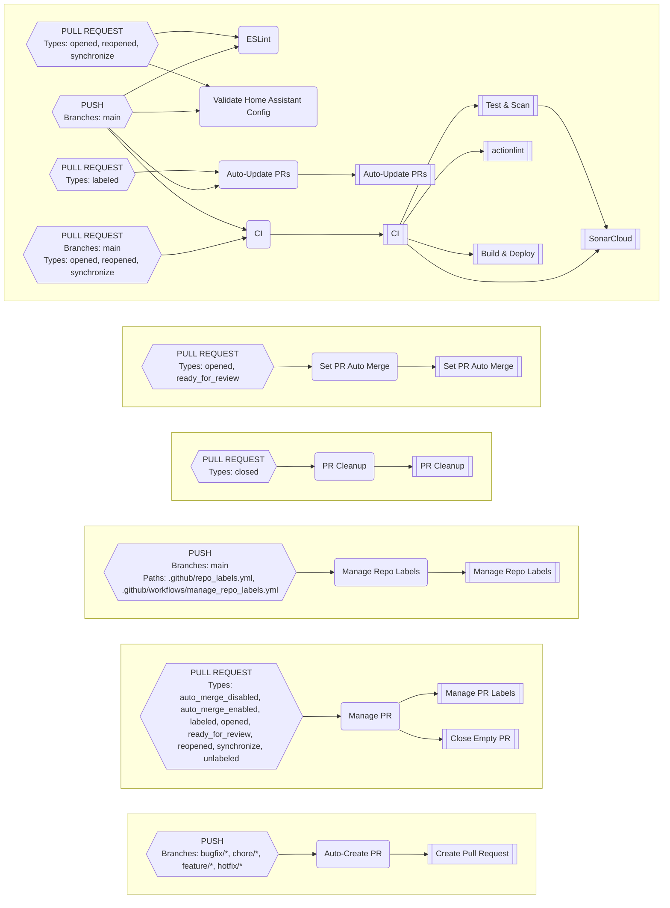

# GitHub Config Files

## Repository File Mappings

### All Mappings

| Destination | [addon-item-warehouse-api](https://github.com/worgarside/addon-item-warehouse-api) | [addon-item-warehouse-website](https://github.com/worgarside/addon-item-warehouse-website) | [addon-yas-209-bridge](https://github.com/worgarside/addon-yas-209-bridge) | [home-assistant](https://github.com/worgarside/home-assistant) | [home-assistant-appdaemon](https://github.com/worgarside/home-assistant-appdaemon) | [home-assistant-config-validator](https://github.com/worgarside/home-assistant-config-validator) | [led-matrix-now-playing](https://github.com/worgarside/led-matrix-now-playing) | [plant-monitor](https://github.com/worgarside/plant-monitor) | [pre-commit-hooks-dependency-sync](https://github.com/worgarside/pre-commit-hooks-dependency-sync) | [python-template](https://github.com/worgarside/python-template) | [smart-mini-crt-interface](https://github.com/worgarside/smart-mini-crt-interface) | [very-slow-movie-player](https://github.com/worgarside/very-slow-movie-player) | [wg-scripts](https://github.com/worgarside/wg-scripts) | [wg-utilities](https://github.com/worgarside/wg-utilities) |
|-------------|--------|--------|--------|--------|--------|--------|--------|--------|--------|--------|--------|--------|--------|--------|
| **.github/CODEOWNERS** | [.github/CODEOWNERS](.github/CODEOWNERS) | [.github/CODEOWNERS](.github/CODEOWNERS) | [.github/CODEOWNERS](.github/CODEOWNERS) | [.github/CODEOWNERS](.github/CODEOWNERS) | [.github/CODEOWNERS](.github/CODEOWNERS) | [.github/CODEOWNERS](.github/CODEOWNERS) | [.github/CODEOWNERS](.github/CODEOWNERS) | [.github/CODEOWNERS](.github/CODEOWNERS) | [.github/CODEOWNERS](.github/CODEOWNERS) | [.github/CODEOWNERS](.github/CODEOWNERS) | [.github/CODEOWNERS](.github/CODEOWNERS) | [.github/CODEOWNERS](.github/CODEOWNERS) | [.github/CODEOWNERS](.github/CODEOWNERS) | [.github/CODEOWNERS](.github/CODEOWNERS) |
| **.github/dependabot.yml** | [.github/dependabot.yml](.github/dependabot.yml) | [.github/dependabot.yml](.github/dependabot.yml) | [.github/dependabot.yml](.github/dependabot.yml) | [.github/dependabot.yml](.github/dependabot.yml) | [.github/dependabot.yml](.github/dependabot.yml) | [.github/dependabot.yml](.github/dependabot.yml) | [.github/dependabot.yml](.github/dependabot.yml) | [.github/dependabot.yml](.github/dependabot.yml) | [.github/dependabot.yml](.github/dependabot.yml) | [.github/dependabot.yml](.github/dependabot.yml) | [.github/dependabot.yml](.github/dependabot.yml) | [.github/dependabot.yml](.github/dependabot.yml) | [.github/dependabot.yml](.github/dependabot.yml) | [.github/dependabot.yml](.github/dependabot.yml) |
| **.github/labeler.yml** | [.github/labeler.yml](.github/labeler.yml) | [.github/labeler.yml](.github/labeler.yml) | [.github/labeler.yml](.github/labeler.yml) | | [.github/labeler.yml](.github/labeler.yml) | [.github/labeler.yml](.github/labeler.yml) | [.github/labeler.yml](.github/labeler.yml) | [.github/labeler.yml](.github/labeler.yml) | [.github/labeler.yml](.github/labeler.yml) | [.github/labeler.yml](.github/labeler.yml) | [.github/labeler.yml](.github/labeler.yml) | [.github/labeler.yml](.github/labeler.yml) | [.github/labeler.yml](.github/labeler.yml) | [.github/labeler.yml](.github/labeler.yml) |
| **.github/release-drafter.yml** | [gha_sync/configs/release-drafter.yml](gha_sync/configs/release-drafter.yml) | [gha_sync/configs/release-drafter.yml](gha_sync/configs/release-drafter.yml) | [gha_sync/configs/release-drafter.yml](gha_sync/configs/release-drafter.yml) | [gha_sync/configs/release-drafter.yml](gha_sync/configs/release-drafter.yml) | [gha_sync/configs/release-drafter.yml](gha_sync/configs/release-drafter.yml) | [gha_sync/configs/release-drafter.yml](gha_sync/configs/release-drafter.yml) | | | [gha_sync/configs/release-drafter.yml](gha_sync/configs/release-drafter.yml) | | | | | [gha_sync/configs/release-drafter.yml](gha_sync/configs/release-drafter.yml) |
| **.github/repo_labels.yml** | [.github/repo_labels.yml](.github/repo_labels.yml) | [.github/repo_labels.yml](.github/repo_labels.yml) | [.github/repo_labels.yml](.github/repo_labels.yml) | | [.github/repo_labels.yml](.github/repo_labels.yml) | [.github/repo_labels.yml](.github/repo_labels.yml) | [.github/repo_labels.yml](.github/repo_labels.yml) | [.github/repo_labels.yml](.github/repo_labels.yml) | [.github/repo_labels.yml](.github/repo_labels.yml) | [.github/repo_labels.yml](.github/repo_labels.yml) | [.github/repo_labels.yml](.github/repo_labels.yml) | [.github/repo_labels.yml](.github/repo_labels.yml) | [.github/repo_labels.yml](.github/repo_labels.yml) | [.github/repo_labels.yml](.github/repo_labels.yml) |
| **.github/workflows/auto_create_pr.yml** | [gha_sync/workflows/all/auto_create_pr.yml](gha_sync/workflows/all/auto_create_pr.yml) | [gha_sync/workflows/all/auto_create_pr.yml](gha_sync/workflows/all/auto_create_pr.yml) | [gha_sync/workflows/all/auto_create_pr.yml](gha_sync/workflows/all/auto_create_pr.yml) | [gha_sync/workflows/all/auto_create_pr.yml](gha_sync/workflows/all/auto_create_pr.yml) | [gha_sync/workflows/all/auto_create_pr.yml](gha_sync/workflows/all/auto_create_pr.yml) | [gha_sync/workflows/all/auto_create_pr.yml](gha_sync/workflows/all/auto_create_pr.yml) | [gha_sync/workflows/all/auto_create_pr.yml](gha_sync/workflows/all/auto_create_pr.yml) | [gha_sync/workflows/all/auto_create_pr.yml](gha_sync/workflows/all/auto_create_pr.yml) | [gha_sync/workflows/all/auto_create_pr.yml](gha_sync/workflows/all/auto_create_pr.yml) | [gha_sync/workflows/all/auto_create_pr.yml](gha_sync/workflows/all/auto_create_pr.yml) | [gha_sync/workflows/all/auto_create_pr.yml](gha_sync/workflows/all/auto_create_pr.yml) | [gha_sync/workflows/all/auto_create_pr.yml](gha_sync/workflows/all/auto_create_pr.yml) | [gha_sync/workflows/all/auto_create_pr.yml](gha_sync/workflows/all/auto_create_pr.yml) | [gha_sync/workflows/all/auto_create_pr.yml](gha_sync/workflows/all/auto_create_pr.yml) |
| **.github/workflows/ci.yml** | [gha_sync/workflows/template/ci.template.yml](gha_sync/workflows/template/ci.template.yml) | [gha_sync/workflows/template/ci.template.yml](gha_sync/workflows/template/ci.template.yml) | [gha_sync/workflows/template/ci.template.yml](gha_sync/workflows/template/ci.template.yml) | [gha_sync/workflows/template/ci.template.yml](gha_sync/workflows/template/ci.template.yml) | [gha_sync/workflows/template/ci.template.yml](gha_sync/workflows/template/ci.template.yml) | [gha_sync/workflows/template/ci.template.yml](gha_sync/workflows/template/ci.template.yml) | [gha_sync/workflows/template/ci.template.yml](gha_sync/workflows/template/ci.template.yml) | [gha_sync/workflows/template/ci.template.yml](gha_sync/workflows/template/ci.template.yml) | [gha_sync/workflows/template/ci.template.yml](gha_sync/workflows/template/ci.template.yml) | | [gha_sync/workflows/template/ci.template.yml](gha_sync/workflows/template/ci.template.yml) | [gha_sync/workflows/template/ci.template.yml](gha_sync/workflows/template/ci.template.yml) | [gha_sync/workflows/template/ci.template.yml](gha_sync/workflows/template/ci.template.yml) | [gha_sync/workflows/template/ci.template.yml](gha_sync/workflows/template/ci.template.yml) |
| **.github/workflows/eslint.yml** | | [gha_sync/workflows/repo/addon-item-warehouse-website/eslint.yml](gha_sync/workflows/repo/addon-item-warehouse-website/eslint.yml) | | | | | | | | | | | | |
| **.github/workflows/manage_pr.yml** | [gha_sync/workflows/all/manage_pr.yml](gha_sync/workflows/all/manage_pr.yml) | [gha_sync/workflows/all/manage_pr.yml](gha_sync/workflows/all/manage_pr.yml) | [gha_sync/workflows/all/manage_pr.yml](gha_sync/workflows/all/manage_pr.yml) | [gha_sync/workflows/all/manage_pr.yml](gha_sync/workflows/all/manage_pr.yml) | [gha_sync/workflows/all/manage_pr.yml](gha_sync/workflows/all/manage_pr.yml) | [gha_sync/workflows/all/manage_pr.yml](gha_sync/workflows/all/manage_pr.yml) | [gha_sync/workflows/all/manage_pr.yml](gha_sync/workflows/all/manage_pr.yml) | [gha_sync/workflows/all/manage_pr.yml](gha_sync/workflows/all/manage_pr.yml) | [gha_sync/workflows/all/manage_pr.yml](gha_sync/workflows/all/manage_pr.yml) | [gha_sync/workflows/all/manage_pr.yml](gha_sync/workflows/all/manage_pr.yml) | [gha_sync/workflows/all/manage_pr.yml](gha_sync/workflows/all/manage_pr.yml) | [gha_sync/workflows/all/manage_pr.yml](gha_sync/workflows/all/manage_pr.yml) | [gha_sync/workflows/all/manage_pr.yml](gha_sync/workflows/all/manage_pr.yml) | [gha_sync/workflows/all/manage_pr.yml](gha_sync/workflows/all/manage_pr.yml) |
| **.github/workflows/manage_repo_labels.yml** | [gha_sync/workflows/all/manage_repo_labels.yml](gha_sync/workflows/all/manage_repo_labels.yml) | [gha_sync/workflows/all/manage_repo_labels.yml](gha_sync/workflows/all/manage_repo_labels.yml) | [gha_sync/workflows/all/manage_repo_labels.yml](gha_sync/workflows/all/manage_repo_labels.yml) | [gha_sync/workflows/all/manage_repo_labels.yml](gha_sync/workflows/all/manage_repo_labels.yml) | [gha_sync/workflows/all/manage_repo_labels.yml](gha_sync/workflows/all/manage_repo_labels.yml) | [gha_sync/workflows/all/manage_repo_labels.yml](gha_sync/workflows/all/manage_repo_labels.yml) | [gha_sync/workflows/all/manage_repo_labels.yml](gha_sync/workflows/all/manage_repo_labels.yml) | [gha_sync/workflows/all/manage_repo_labels.yml](gha_sync/workflows/all/manage_repo_labels.yml) | [gha_sync/workflows/all/manage_repo_labels.yml](gha_sync/workflows/all/manage_repo_labels.yml) | [gha_sync/workflows/all/manage_repo_labels.yml](gha_sync/workflows/all/manage_repo_labels.yml) | [gha_sync/workflows/all/manage_repo_labels.yml](gha_sync/workflows/all/manage_repo_labels.yml) | [gha_sync/workflows/all/manage_repo_labels.yml](gha_sync/workflows/all/manage_repo_labels.yml) | [gha_sync/workflows/all/manage_repo_labels.yml](gha_sync/workflows/all/manage_repo_labels.yml) | [gha_sync/workflows/all/manage_repo_labels.yml](gha_sync/workflows/all/manage_repo_labels.yml) |
| **.github/workflows/pr_autoupdate.yml** | [gha_sync/workflows/all/pr_autoupdate.yml](gha_sync/workflows/all/pr_autoupdate.yml) | [gha_sync/workflows/all/pr_autoupdate.yml](gha_sync/workflows/all/pr_autoupdate.yml) | [gha_sync/workflows/all/pr_autoupdate.yml](gha_sync/workflows/all/pr_autoupdate.yml) | [gha_sync/workflows/all/pr_autoupdate.yml](gha_sync/workflows/all/pr_autoupdate.yml) | [gha_sync/workflows/all/pr_autoupdate.yml](gha_sync/workflows/all/pr_autoupdate.yml) | [gha_sync/workflows/all/pr_autoupdate.yml](gha_sync/workflows/all/pr_autoupdate.yml) | [gha_sync/workflows/all/pr_autoupdate.yml](gha_sync/workflows/all/pr_autoupdate.yml) | [gha_sync/workflows/all/pr_autoupdate.yml](gha_sync/workflows/all/pr_autoupdate.yml) | [gha_sync/workflows/all/pr_autoupdate.yml](gha_sync/workflows/all/pr_autoupdate.yml) | [gha_sync/workflows/all/pr_autoupdate.yml](gha_sync/workflows/all/pr_autoupdate.yml) | [gha_sync/workflows/all/pr_autoupdate.yml](gha_sync/workflows/all/pr_autoupdate.yml) | [gha_sync/workflows/all/pr_autoupdate.yml](gha_sync/workflows/all/pr_autoupdate.yml) | [gha_sync/workflows/all/pr_autoupdate.yml](gha_sync/workflows/all/pr_autoupdate.yml) | [gha_sync/workflows/all/pr_autoupdate.yml](gha_sync/workflows/all/pr_autoupdate.yml) |
| **.github/workflows/pr_cleanup.yml** | [gha_sync/workflows/all/pr_cleanup.yml](gha_sync/workflows/all/pr_cleanup.yml) | [gha_sync/workflows/all/pr_cleanup.yml](gha_sync/workflows/all/pr_cleanup.yml) | [gha_sync/workflows/all/pr_cleanup.yml](gha_sync/workflows/all/pr_cleanup.yml) | [gha_sync/workflows/all/pr_cleanup.yml](gha_sync/workflows/all/pr_cleanup.yml) | [gha_sync/workflows/all/pr_cleanup.yml](gha_sync/workflows/all/pr_cleanup.yml) | [gha_sync/workflows/all/pr_cleanup.yml](gha_sync/workflows/all/pr_cleanup.yml) | [gha_sync/workflows/all/pr_cleanup.yml](gha_sync/workflows/all/pr_cleanup.yml) | [gha_sync/workflows/all/pr_cleanup.yml](gha_sync/workflows/all/pr_cleanup.yml) | [gha_sync/workflows/all/pr_cleanup.yml](gha_sync/workflows/all/pr_cleanup.yml) | [gha_sync/workflows/all/pr_cleanup.yml](gha_sync/workflows/all/pr_cleanup.yml) | [gha_sync/workflows/all/pr_cleanup.yml](gha_sync/workflows/all/pr_cleanup.yml) | [gha_sync/workflows/all/pr_cleanup.yml](gha_sync/workflows/all/pr_cleanup.yml) | [gha_sync/workflows/all/pr_cleanup.yml](gha_sync/workflows/all/pr_cleanup.yml) | [gha_sync/workflows/all/pr_cleanup.yml](gha_sync/workflows/all/pr_cleanup.yml) |
| **.github/workflows/set_pr_auto_merge.yml** | [gha_sync/workflows/all/set_pr_auto_merge.yml](gha_sync/workflows/all/set_pr_auto_merge.yml) | [gha_sync/workflows/all/set_pr_auto_merge.yml](gha_sync/workflows/all/set_pr_auto_merge.yml) | [gha_sync/workflows/all/set_pr_auto_merge.yml](gha_sync/workflows/all/set_pr_auto_merge.yml) | [gha_sync/workflows/all/set_pr_auto_merge.yml](gha_sync/workflows/all/set_pr_auto_merge.yml) | [gha_sync/workflows/all/set_pr_auto_merge.yml](gha_sync/workflows/all/set_pr_auto_merge.yml) | [gha_sync/workflows/all/set_pr_auto_merge.yml](gha_sync/workflows/all/set_pr_auto_merge.yml) | [gha_sync/workflows/all/set_pr_auto_merge.yml](gha_sync/workflows/all/set_pr_auto_merge.yml) | [gha_sync/workflows/all/set_pr_auto_merge.yml](gha_sync/workflows/all/set_pr_auto_merge.yml) | [gha_sync/workflows/all/set_pr_auto_merge.yml](gha_sync/workflows/all/set_pr_auto_merge.yml) | [gha_sync/workflows/all/set_pr_auto_merge.yml](gha_sync/workflows/all/set_pr_auto_merge.yml) | [gha_sync/workflows/all/set_pr_auto_merge.yml](gha_sync/workflows/all/set_pr_auto_merge.yml) | [gha_sync/workflows/all/set_pr_auto_merge.yml](gha_sync/workflows/all/set_pr_auto_merge.yml) | [gha_sync/workflows/all/set_pr_auto_merge.yml](gha_sync/workflows/all/set_pr_auto_merge.yml) | [gha_sync/workflows/all/set_pr_auto_merge.yml](gha_sync/workflows/all/set_pr_auto_merge.yml) |
| **.github/workflows/validate_home_assistant_config.yml** | | | | [gha_sync/workflows/repo/home-assistant/validate_home_assistant_config.yml](gha_sync/workflows/repo/home-assistant/validate_home_assistant_config.yml) | | | | | | | | | | |
| **.gitignore** | [.gitignore](.gitignore) | [.gitignore](.gitignore) | [.gitignore](.gitignore) | [.gitignore](.gitignore) | [.gitignore](.gitignore) | [.gitignore](.gitignore) | [.gitignore](.gitignore) | [.gitignore](.gitignore) | [.gitignore](.gitignore) | [.gitignore](.gitignore) | [.gitignore](.gitignore) | [.gitignore](.gitignore) | [.gitignore](.gitignore) | [.gitignore](.gitignore) |
| **.pylintrc** | [.pylintrc](.pylintrc) | | [.pylintrc](.pylintrc) | [.pylintrc](.pylintrc) | [.pylintrc](.pylintrc) | [.pylintrc](.pylintrc) | [.pylintrc](.pylintrc) | [.pylintrc](.pylintrc) | [.pylintrc](.pylintrc) | [.pylintrc](.pylintrc) | [.pylintrc](.pylintrc) | [.pylintrc](.pylintrc) | [.pylintrc](.pylintrc) | [.pylintrc](.pylintrc) |
| **.yamllint** | [.yamllint](.yamllint) | | [.yamllint](.yamllint) | | [.yamllint](.yamllint) | [.yamllint](.yamllint) | [.yamllint](.yamllint) | [.yamllint](.yamllint) | [.yamllint](.yamllint) | [.yamllint](.yamllint) | [.yamllint](.yamllint) | [.yamllint](.yamllint) | [.yamllint](.yamllint) | |
### Per-Repository Mappings

### [addon-item-warehouse-api](https://github.com/worgarside/addon-item-warehouse-api) (15 files)

Mapping Table

| Source | Destination |
|--------|-------------|
| [.github/CODEOWNERS](.github/CODEOWNERS) | [.github/CODEOWNERS](https://github.com/worgarside/addon-item-warehouse-api/.github/CODEOWNERS) |
| [.github/dependabot.yml](.github/dependabot.yml) | [.github/dependabot.yml](https://github.com/worgarside/addon-item-warehouse-api/.github/dependabot.yml) |
| [.github/labeler.yml](.github/labeler.yml) | [.github/labeler.yml](https://github.com/worgarside/addon-item-warehouse-api/.github/labeler.yml) |
| [.github/repo_labels.yml](.github/repo_labels.yml) | [.github/repo_labels.yml](https://github.com/worgarside/addon-item-warehouse-api/.github/repo_labels.yml) |
| [.gitignore](.gitignore) | [.gitignore](https://github.com/worgarside/addon-item-warehouse-api/.gitignore) |
| [.pylintrc](.pylintrc) | [.pylintrc](https://github.com/worgarside/addon-item-warehouse-api/.pylintrc) |
| [.yamllint](.yamllint) | [.yamllint](https://github.com/worgarside/addon-item-warehouse-api/.yamllint) |
| [gha_sync/configs/release-drafter.yml](gha_sync/configs/release-drafter.yml) | [.github/release-drafter.yml](https://github.com/worgarside/addon-item-warehouse-api/.github/release-drafter.yml) |
| [gha_sync/workflows/all/auto_create_pr.yml](gha_sync/workflows/all/auto_create_pr.yml) | [.github/workflows/auto_create_pr.yml](https://github.com/worgarside/addon-item-warehouse-api/.github/workflows/auto_create_pr.yml) |
| [gha_sync/workflows/all/manage_pr.yml](gha_sync/workflows/all/manage_pr.yml) | [.github/workflows/manage_pr.yml](https://github.com/worgarside/addon-item-warehouse-api/.github/workflows/manage_pr.yml) |
| [gha_sync/workflows/all/manage_repo_labels.yml](gha_sync/workflows/all/manage_repo_labels.yml) | [.github/workflows/manage_repo_labels.yml](https://github.com/worgarside/addon-item-warehouse-api/.github/workflows/manage_repo_labels.yml) |
| [gha_sync/workflows/all/pr_autoupdate.yml](gha_sync/workflows/all/pr_autoupdate.yml) | [.github/workflows/pr_autoupdate.yml](https://github.com/worgarside/addon-item-warehouse-api/.github/workflows/pr_autoupdate.yml) |
| [gha_sync/workflows/all/pr_cleanup.yml](gha_sync/workflows/all/pr_cleanup.yml) | [.github/workflows/pr_cleanup.yml](https://github.com/worgarside/addon-item-warehouse-api/.github/workflows/pr_cleanup.yml) |
| [gha_sync/workflows/all/set_pr_auto_merge.yml](gha_sync/workflows/all/set_pr_auto_merge.yml) | [.github/workflows/set_pr_auto_merge.yml](https://github.com/worgarside/addon-item-warehouse-api/.github/workflows/set_pr_auto_merge.yml) |
| [gha_sync/workflows/template/ci.template.yml](gha_sync/workflows/template/ci.template.yml) | [.github/workflows/ci.yml](https://github.com/worgarside/addon-item-warehouse-api/.github/workflows/ci.yml) |

### [addon-item-warehouse-website](https://github.com/worgarside/addon-item-warehouse-website) (14 files)

Mapping Table

| Source | Destination |
|--------|-------------|
| [.github/CODEOWNERS](.github/CODEOWNERS) | [.github/CODEOWNERS](https://github.com/worgarside/addon-item-warehouse-website/.github/CODEOWNERS) |
| [.github/dependabot.yml](.github/dependabot.yml) | [.github/dependabot.yml](https://github.com/worgarside/addon-item-warehouse-website/.github/dependabot.yml) |
| [.github/labeler.yml](.github/labeler.yml) | [.github/labeler.yml](https://github.com/worgarside/addon-item-warehouse-website/.github/labeler.yml) |
| [.github/repo_labels.yml](.github/repo_labels.yml) | [.github/repo_labels.yml](https://github.com/worgarside/addon-item-warehouse-website/.github/repo_labels.yml) |
| [.gitignore](.gitignore) | [.gitignore](https://github.com/worgarside/addon-item-warehouse-website/.gitignore) |
| [gha_sync/configs/release-drafter.yml](gha_sync/configs/release-drafter.yml) | [.github/release-drafter.yml](https://github.com/worgarside/addon-item-warehouse-website/.github/release-drafter.yml) |
| [gha_sync/workflows/all/auto_create_pr.yml](gha_sync/workflows/all/auto_create_pr.yml) | [.github/workflows/auto_create_pr.yml](https://github.com/worgarside/addon-item-warehouse-website/.github/workflows/auto_create_pr.yml) |
| [gha_sync/workflows/all/manage_pr.yml](gha_sync/workflows/all/manage_pr.yml) | [.github/workflows/manage_pr.yml](https://github.com/worgarside/addon-item-warehouse-website/.github/workflows/manage_pr.yml) |
| [gha_sync/workflows/all/manage_repo_labels.yml](gha_sync/workflows/all/manage_repo_labels.yml) | [.github/workflows/manage_repo_labels.yml](https://github.com/worgarside/addon-item-warehouse-website/.github/workflows/manage_repo_labels.yml) |
| [gha_sync/workflows/all/pr_autoupdate.yml](gha_sync/workflows/all/pr_autoupdate.yml) | [.github/workflows/pr_autoupdate.yml](https://github.com/worgarside/addon-item-warehouse-website/.github/workflows/pr_autoupdate.yml) |
| [gha_sync/workflows/all/pr_cleanup.yml](gha_sync/workflows/all/pr_cleanup.yml) | [.github/workflows/pr_cleanup.yml](https://github.com/worgarside/addon-item-warehouse-website/.github/workflows/pr_cleanup.yml) |
| [gha_sync/workflows/all/set_pr_auto_merge.yml](gha_sync/workflows/all/set_pr_auto_merge.yml) | [.github/workflows/set_pr_auto_merge.yml](https://github.com/worgarside/addon-item-warehouse-website/.github/workflows/set_pr_auto_merge.yml) |
| [gha_sync/workflows/repo/addon-item-warehouse-website/eslint.yml](gha_sync/workflows/repo/addon-item-warehouse-website/eslint.yml) | [.github/workflows/eslint.yml](https://github.com/worgarside/addon-item-warehouse-website/.github/workflows/eslint.yml) |
| [gha_sync/workflows/template/ci.template.yml](gha_sync/workflows/template/ci.template.yml) | [.github/workflows/ci.yml](https://github.com/worgarside/addon-item-warehouse-website/.github/workflows/ci.yml) |

### [addon-yas-209-bridge](https://github.com/worgarside/addon-yas-209-bridge) (15 files)

Mapping Table

| Source | Destination |
|--------|-------------|
| [.github/CODEOWNERS](.github/CODEOWNERS) | [.github/CODEOWNERS](https://github.com/worgarside/addon-yas-209-bridge/.github/CODEOWNERS) |
| [.github/dependabot.yml](.github/dependabot.yml) | [.github/dependabot.yml](https://github.com/worgarside/addon-yas-209-bridge/.github/dependabot.yml) |
| [.github/labeler.yml](.github/labeler.yml) | [.github/labeler.yml](https://github.com/worgarside/addon-yas-209-bridge/.github/labeler.yml) |
| [.github/repo_labels.yml](.github/repo_labels.yml) | [.github/repo_labels.yml](https://github.com/worgarside/addon-yas-209-bridge/.github/repo_labels.yml) |
| [.gitignore](.gitignore) | [.gitignore](https://github.com/worgarside/addon-yas-209-bridge/.gitignore) |
| [.pylintrc](.pylintrc) | [.pylintrc](https://github.com/worgarside/addon-yas-209-bridge/.pylintrc) |
| [.yamllint](.yamllint) | [.yamllint](https://github.com/worgarside/addon-yas-209-bridge/.yamllint) |
| [gha_sync/configs/release-drafter.yml](gha_sync/configs/release-drafter.yml) | [.github/release-drafter.yml](https://github.com/worgarside/addon-yas-209-bridge/.github/release-drafter.yml) |
| [gha_sync/workflows/all/auto_create_pr.yml](gha_sync/workflows/all/auto_create_pr.yml) | [.github/workflows/auto_create_pr.yml](https://github.com/worgarside/addon-yas-209-bridge/.github/workflows/auto_create_pr.yml) |
| [gha_sync/workflows/all/manage_pr.yml](gha_sync/workflows/all/manage_pr.yml) | [.github/workflows/manage_pr.yml](https://github.com/worgarside/addon-yas-209-bridge/.github/workflows/manage_pr.yml) |
| [gha_sync/workflows/all/manage_repo_labels.yml](gha_sync/workflows/all/manage_repo_labels.yml) | [.github/workflows/manage_repo_labels.yml](https://github.com/worgarside/addon-yas-209-bridge/.github/workflows/manage_repo_labels.yml) |
| [gha_sync/workflows/all/pr_autoupdate.yml](gha_sync/workflows/all/pr_autoupdate.yml) | [.github/workflows/pr_autoupdate.yml](https://github.com/worgarside/addon-yas-209-bridge/.github/workflows/pr_autoupdate.yml) |
| [gha_sync/workflows/all/pr_cleanup.yml](gha_sync/workflows/all/pr_cleanup.yml) | [.github/workflows/pr_cleanup.yml](https://github.com/worgarside/addon-yas-209-bridge/.github/workflows/pr_cleanup.yml) |
| [gha_sync/workflows/all/set_pr_auto_merge.yml](gha_sync/workflows/all/set_pr_auto_merge.yml) | [.github/workflows/set_pr_auto_merge.yml](https://github.com/worgarside/addon-yas-209-bridge/.github/workflows/set_pr_auto_merge.yml) |
| [gha_sync/workflows/template/ci.template.yml](gha_sync/workflows/template/ci.template.yml) | [.github/workflows/ci.yml](https://github.com/worgarside/addon-yas-209-bridge/.github/workflows/ci.yml) |

### [home-assistant](https://github.com/worgarside/home-assistant) (13 files)

Mapping Table

| Source | Destination |
|--------|-------------|
| [.github/CODEOWNERS](.github/CODEOWNERS) | [.github/CODEOWNERS](https://github.com/worgarside/home-assistant/.github/CODEOWNERS) |
| [.github/dependabot.yml](.github/dependabot.yml) | [.github/dependabot.yml](https://github.com/worgarside/home-assistant/.github/dependabot.yml) |
| [.gitignore](.gitignore) | [.gitignore](https://github.com/worgarside/home-assistant/.gitignore) |
| [.pylintrc](.pylintrc) | [.pylintrc](https://github.com/worgarside/home-assistant/.pylintrc) |
| [gha_sync/configs/release-drafter.yml](gha_sync/configs/release-drafter.yml) | [.github/release-drafter.yml](https://github.com/worgarside/home-assistant/.github/release-drafter.yml) |
| [gha_sync/workflows/all/auto_create_pr.yml](gha_sync/workflows/all/auto_create_pr.yml) | [.github/workflows/auto_create_pr.yml](https://github.com/worgarside/home-assistant/.github/workflows/auto_create_pr.yml) |
| [gha_sync/workflows/all/manage_pr.yml](gha_sync/workflows/all/manage_pr.yml) | [.github/workflows/manage_pr.yml](https://github.com/worgarside/home-assistant/.github/workflows/manage_pr.yml) |
| [gha_sync/workflows/all/manage_repo_labels.yml](gha_sync/workflows/all/manage_repo_labels.yml) | [.github/workflows/manage_repo_labels.yml](https://github.com/worgarside/home-assistant/.github/workflows/manage_repo_labels.yml) |
| [gha_sync/workflows/all/pr_autoupdate.yml](gha_sync/workflows/all/pr_autoupdate.yml) | [.github/workflows/pr_autoupdate.yml](https://github.com/worgarside/home-assistant/.github/workflows/pr_autoupdate.yml) |
| [gha_sync/workflows/all/pr_cleanup.yml](gha_sync/workflows/all/pr_cleanup.yml) | [.github/workflows/pr_cleanup.yml](https://github.com/worgarside/home-assistant/.github/workflows/pr_cleanup.yml) |
| [gha_sync/workflows/all/set_pr_auto_merge.yml](gha_sync/workflows/all/set_pr_auto_merge.yml) | [.github/workflows/set_pr_auto_merge.yml](https://github.com/worgarside/home-assistant/.github/workflows/set_pr_auto_merge.yml) |
| [gha_sync/workflows/repo/home-assistant/validate_home_assistant_config.yml](gha_sync/workflows/repo/home-assistant/validate_home_assistant_config.yml) | [.github/workflows/validate_home_assistant_config.yml](https://github.com/worgarside/home-assistant/.github/workflows/validate_home_assistant_config.yml) |
| [gha_sync/workflows/template/ci.template.yml](gha_sync/workflows/template/ci.template.yml) | [.github/workflows/ci.yml](https://github.com/worgarside/home-assistant/.github/workflows/ci.yml) |

### [home-assistant-appdaemon](https://github.com/worgarside/home-assistant-appdaemon) (15 files)

Mapping Table

| Source | Destination |
|--------|-------------|
| [.github/CODEOWNERS](.github/CODEOWNERS) | [.github/CODEOWNERS](https://github.com/worgarside/home-assistant-appdaemon/.github/CODEOWNERS) |
| [.github/dependabot.yml](.github/dependabot.yml) | [.github/dependabot.yml](https://github.com/worgarside/home-assistant-appdaemon/.github/dependabot.yml) |
| [.github/labeler.yml](.github/labeler.yml) | [.github/labeler.yml](https://github.com/worgarside/home-assistant-appdaemon/.github/labeler.yml) |
| [.github/repo_labels.yml](.github/repo_labels.yml) | [.github/repo_labels.yml](https://github.com/worgarside/home-assistant-appdaemon/.github/repo_labels.yml) |
| [.gitignore](.gitignore) | [.gitignore](https://github.com/worgarside/home-assistant-appdaemon/.gitignore) |
| [.pylintrc](.pylintrc) | [.pylintrc](https://github.com/worgarside/home-assistant-appdaemon/.pylintrc) |
| [.yamllint](.yamllint) | [.yamllint](https://github.com/worgarside/home-assistant-appdaemon/.yamllint) |
| [gha_sync/configs/release-drafter.yml](gha_sync/configs/release-drafter.yml) | [.github/release-drafter.yml](https://github.com/worgarside/home-assistant-appdaemon/.github/release-drafter.yml) |
| [gha_sync/workflows/all/auto_create_pr.yml](gha_sync/workflows/all/auto_create_pr.yml) | [.github/workflows/auto_create_pr.yml](https://github.com/worgarside/home-assistant-appdaemon/.github/workflows/auto_create_pr.yml) |
| [gha_sync/workflows/all/manage_pr.yml](gha_sync/workflows/all/manage_pr.yml) | [.github/workflows/manage_pr.yml](https://github.com/worgarside/home-assistant-appdaemon/.github/workflows/manage_pr.yml) |
| [gha_sync/workflows/all/manage_repo_labels.yml](gha_sync/workflows/all/manage_repo_labels.yml) | [.github/workflows/manage_repo_labels.yml](https://github.com/worgarside/home-assistant-appdaemon/.github/workflows/manage_repo_labels.yml) |
| [gha_sync/workflows/all/pr_autoupdate.yml](gha_sync/workflows/all/pr_autoupdate.yml) | [.github/workflows/pr_autoupdate.yml](https://github.com/worgarside/home-assistant-appdaemon/.github/workflows/pr_autoupdate.yml) |
| [gha_sync/workflows/all/pr_cleanup.yml](gha_sync/workflows/all/pr_cleanup.yml) | [.github/workflows/pr_cleanup.yml](https://github.com/worgarside/home-assistant-appdaemon/.github/workflows/pr_cleanup.yml) |
| [gha_sync/workflows/all/set_pr_auto_merge.yml](gha_sync/workflows/all/set_pr_auto_merge.yml) | [.github/workflows/set_pr_auto_merge.yml](https://github.com/worgarside/home-assistant-appdaemon/.github/workflows/set_pr_auto_merge.yml) |
| [gha_sync/workflows/template/ci.template.yml](gha_sync/workflows/template/ci.template.yml) | [.github/workflows/ci.yml](https://github.com/worgarside/home-assistant-appdaemon/.github/workflows/ci.yml) |

### [home-assistant-config-validator](https://github.com/worgarside/home-assistant-config-validator) (15 files)

Mapping Table

| Source | Destination |
|--------|-------------|
| [.github/CODEOWNERS](.github/CODEOWNERS) | [.github/CODEOWNERS](https://github.com/worgarside/home-assistant-config-validator/.github/CODEOWNERS) |
| [.github/dependabot.yml](.github/dependabot.yml) | [.github/dependabot.yml](https://github.com/worgarside/home-assistant-config-validator/.github/dependabot.yml) |
| [.github/labeler.yml](.github/labeler.yml) | [.github/labeler.yml](https://github.com/worgarside/home-assistant-config-validator/.github/labeler.yml) |
| [.github/repo_labels.yml](.github/repo_labels.yml) | [.github/repo_labels.yml](https://github.com/worgarside/home-assistant-config-validator/.github/repo_labels.yml) |
| [.gitignore](.gitignore) | [.gitignore](https://github.com/worgarside/home-assistant-config-validator/.gitignore) |
| [.pylintrc](.pylintrc) | [.pylintrc](https://github.com/worgarside/home-assistant-config-validator/.pylintrc) |
| [.yamllint](.yamllint) | [.yamllint](https://github.com/worgarside/home-assistant-config-validator/.yamllint) |
| [gha_sync/configs/release-drafter.yml](gha_sync/configs/release-drafter.yml) | [.github/release-drafter.yml](https://github.com/worgarside/home-assistant-config-validator/.github/release-drafter.yml) |
| [gha_sync/workflows/all/auto_create_pr.yml](gha_sync/workflows/all/auto_create_pr.yml) | [.github/workflows/auto_create_pr.yml](https://github.com/worgarside/home-assistant-config-validator/.github/workflows/auto_create_pr.yml) |
| [gha_sync/workflows/all/manage_pr.yml](gha_sync/workflows/all/manage_pr.yml) | [.github/workflows/manage_pr.yml](https://github.com/worgarside/home-assistant-config-validator/.github/workflows/manage_pr.yml) |
| [gha_sync/workflows/all/manage_repo_labels.yml](gha_sync/workflows/all/manage_repo_labels.yml) | [.github/workflows/manage_repo_labels.yml](https://github.com/worgarside/home-assistant-config-validator/.github/workflows/manage_repo_labels.yml) |
| [gha_sync/workflows/all/pr_autoupdate.yml](gha_sync/workflows/all/pr_autoupdate.yml) | [.github/workflows/pr_autoupdate.yml](https://github.com/worgarside/home-assistant-config-validator/.github/workflows/pr_autoupdate.yml) |
| [gha_sync/workflows/all/pr_cleanup.yml](gha_sync/workflows/all/pr_cleanup.yml) | [.github/workflows/pr_cleanup.yml](https://github.com/worgarside/home-assistant-config-validator/.github/workflows/pr_cleanup.yml) |
| [gha_sync/workflows/all/set_pr_auto_merge.yml](gha_sync/workflows/all/set_pr_auto_merge.yml) | [.github/workflows/set_pr_auto_merge.yml](https://github.com/worgarside/home-assistant-config-validator/.github/workflows/set_pr_auto_merge.yml) |
| [gha_sync/workflows/template/ci.template.yml](gha_sync/workflows/template/ci.template.yml) | [.github/workflows/ci.yml](https://github.com/worgarside/home-assistant-config-validator/.github/workflows/ci.yml) |

### [led-matrix-now-playing](https://github.com/worgarside/led-matrix-now-playing) (14 files)

Mapping Table

| Source | Destination |
|--------|-------------|
| [.github/CODEOWNERS](.github/CODEOWNERS) | [.github/CODEOWNERS](https://github.com/worgarside/led-matrix-now-playing/.github/CODEOWNERS) |
| [.github/dependabot.yml](.github/dependabot.yml) | [.github/dependabot.yml](https://github.com/worgarside/led-matrix-now-playing/.github/dependabot.yml) |
| [.github/labeler.yml](.github/labeler.yml) | [.github/labeler.yml](https://github.com/worgarside/led-matrix-now-playing/.github/labeler.yml) |
| [.github/repo_labels.yml](.github/repo_labels.yml) | [.github/repo_labels.yml](https://github.com/worgarside/led-matrix-now-playing/.github/repo_labels.yml) |
| [.gitignore](.gitignore) | [.gitignore](https://github.com/worgarside/led-matrix-now-playing/.gitignore) |
| [.pylintrc](.pylintrc) | [.pylintrc](https://github.com/worgarside/led-matrix-now-playing/.pylintrc) |
| [.yamllint](.yamllint) | [.yamllint](https://github.com/worgarside/led-matrix-now-playing/.yamllint) |
| [gha_sync/workflows/all/auto_create_pr.yml](gha_sync/workflows/all/auto_create_pr.yml) | [.github/workflows/auto_create_pr.yml](https://github.com/worgarside/led-matrix-now-playing/.github/workflows/auto_create_pr.yml) |
| [gha_sync/workflows/all/manage_pr.yml](gha_sync/workflows/all/manage_pr.yml) | [.github/workflows/manage_pr.yml](https://github.com/worgarside/led-matrix-now-playing/.github/workflows/manage_pr.yml) |
| [gha_sync/workflows/all/manage_repo_labels.yml](gha_sync/workflows/all/manage_repo_labels.yml) | [.github/workflows/manage_repo_labels.yml](https://github.com/worgarside/led-matrix-now-playing/.github/workflows/manage_repo_labels.yml) |
| [gha_sync/workflows/all/pr_autoupdate.yml](gha_sync/workflows/all/pr_autoupdate.yml) | [.github/workflows/pr_autoupdate.yml](https://github.com/worgarside/led-matrix-now-playing/.github/workflows/pr_autoupdate.yml) |
| [gha_sync/workflows/all/pr_cleanup.yml](gha_sync/workflows/all/pr_cleanup.yml) | [.github/workflows/pr_cleanup.yml](https://github.com/worgarside/led-matrix-now-playing/.github/workflows/pr_cleanup.yml) |
| [gha_sync/workflows/all/set_pr_auto_merge.yml](gha_sync/workflows/all/set_pr_auto_merge.yml) | [.github/workflows/set_pr_auto_merge.yml](https://github.com/worgarside/led-matrix-now-playing/.github/workflows/set_pr_auto_merge.yml) |
| [gha_sync/workflows/template/ci.template.yml](gha_sync/workflows/template/ci.template.yml) | [.github/workflows/ci.yml](https://github.com/worgarside/led-matrix-now-playing/.github/workflows/ci.yml) |

### [plant-monitor](https://github.com/worgarside/plant-monitor) (14 files)

Mapping Table

| Source | Destination |
|--------|-------------|
| [.github/CODEOWNERS](.github/CODEOWNERS) | [.github/CODEOWNERS](https://github.com/worgarside/plant-monitor/.github/CODEOWNERS) |
| [.github/dependabot.yml](.github/dependabot.yml) | [.github/dependabot.yml](https://github.com/worgarside/plant-monitor/.github/dependabot.yml) |
| [.github/labeler.yml](.github/labeler.yml) | [.github/labeler.yml](https://github.com/worgarside/plant-monitor/.github/labeler.yml) |
| [.github/repo_labels.yml](.github/repo_labels.yml) | [.github/repo_labels.yml](https://github.com/worgarside/plant-monitor/.github/repo_labels.yml) |
| [.gitignore](.gitignore) | [.gitignore](https://github.com/worgarside/plant-monitor/.gitignore) |
| [.pylintrc](.pylintrc) | [.pylintrc](https://github.com/worgarside/plant-monitor/.pylintrc) |
| [.yamllint](.yamllint) | [.yamllint](https://github.com/worgarside/plant-monitor/.yamllint) |
| [gha_sync/workflows/all/auto_create_pr.yml](gha_sync/workflows/all/auto_create_pr.yml) | [.github/workflows/auto_create_pr.yml](https://github.com/worgarside/plant-monitor/.github/workflows/auto_create_pr.yml) |
| [gha_sync/workflows/all/manage_pr.yml](gha_sync/workflows/all/manage_pr.yml) | [.github/workflows/manage_pr.yml](https://github.com/worgarside/plant-monitor/.github/workflows/manage_pr.yml) |
| [gha_sync/workflows/all/manage_repo_labels.yml](gha_sync/workflows/all/manage_repo_labels.yml) | [.github/workflows/manage_repo_labels.yml](https://github.com/worgarside/plant-monitor/.github/workflows/manage_repo_labels.yml) |
| [gha_sync/workflows/all/pr_autoupdate.yml](gha_sync/workflows/all/pr_autoupdate.yml) | [.github/workflows/pr_autoupdate.yml](https://github.com/worgarside/plant-monitor/.github/workflows/pr_autoupdate.yml) |
| [gha_sync/workflows/all/pr_cleanup.yml](gha_sync/workflows/all/pr_cleanup.yml) | [.github/workflows/pr_cleanup.yml](https://github.com/worgarside/plant-monitor/.github/workflows/pr_cleanup.yml) |
| [gha_sync/workflows/all/set_pr_auto_merge.yml](gha_sync/workflows/all/set_pr_auto_merge.yml) | [.github/workflows/set_pr_auto_merge.yml](https://github.com/worgarside/plant-monitor/.github/workflows/set_pr_auto_merge.yml) |
| [gha_sync/workflows/template/ci.template.yml](gha_sync/workflows/template/ci.template.yml) | [.github/workflows/ci.yml](https://github.com/worgarside/plant-monitor/.github/workflows/ci.yml) |

### [pre-commit-hooks-dependency-sync](https://github.com/worgarside/pre-commit-hooks-dependency-sync) (15 files)

Mapping Table

| Source | Destination |
|--------|-------------|
| [.github/CODEOWNERS](.github/CODEOWNERS) | [.github/CODEOWNERS](https://github.com/worgarside/pre-commit-hooks-dependency-sync/.github/CODEOWNERS) |
| [.github/dependabot.yml](.github/dependabot.yml) | [.github/dependabot.yml](https://github.com/worgarside/pre-commit-hooks-dependency-sync/.github/dependabot.yml) |
| [.github/labeler.yml](.github/labeler.yml) | [.github/labeler.yml](https://github.com/worgarside/pre-commit-hooks-dependency-sync/.github/labeler.yml) |
| [.github/repo_labels.yml](.github/repo_labels.yml) | [.github/repo_labels.yml](https://github.com/worgarside/pre-commit-hooks-dependency-sync/.github/repo_labels.yml) |
| [.gitignore](.gitignore) | [.gitignore](https://github.com/worgarside/pre-commit-hooks-dependency-sync/.gitignore) |
| [.pylintrc](.pylintrc) | [.pylintrc](https://github.com/worgarside/pre-commit-hooks-dependency-sync/.pylintrc) |
| [.yamllint](.yamllint) | [.yamllint](https://github.com/worgarside/pre-commit-hooks-dependency-sync/.yamllint) |
| [gha_sync/configs/release-drafter.yml](gha_sync/configs/release-drafter.yml) | [.github/release-drafter.yml](https://github.com/worgarside/pre-commit-hooks-dependency-sync/.github/release-drafter.yml) |
| [gha_sync/workflows/all/auto_create_pr.yml](gha_sync/workflows/all/auto_create_pr.yml) | [.github/workflows/auto_create_pr.yml](https://github.com/worgarside/pre-commit-hooks-dependency-sync/.github/workflows/auto_create_pr.yml) |
| [gha_sync/workflows/all/manage_pr.yml](gha_sync/workflows/all/manage_pr.yml) | [.github/workflows/manage_pr.yml](https://github.com/worgarside/pre-commit-hooks-dependency-sync/.github/workflows/manage_pr.yml) |
| [gha_sync/workflows/all/manage_repo_labels.yml](gha_sync/workflows/all/manage_repo_labels.yml) | [.github/workflows/manage_repo_labels.yml](https://github.com/worgarside/pre-commit-hooks-dependency-sync/.github/workflows/manage_repo_labels.yml) |
| [gha_sync/workflows/all/pr_autoupdate.yml](gha_sync/workflows/all/pr_autoupdate.yml) | [.github/workflows/pr_autoupdate.yml](https://github.com/worgarside/pre-commit-hooks-dependency-sync/.github/workflows/pr_autoupdate.yml) |
| [gha_sync/workflows/all/pr_cleanup.yml](gha_sync/workflows/all/pr_cleanup.yml) | [.github/workflows/pr_cleanup.yml](https://github.com/worgarside/pre-commit-hooks-dependency-sync/.github/workflows/pr_cleanup.yml) |
| [gha_sync/workflows/all/set_pr_auto_merge.yml](gha_sync/workflows/all/set_pr_auto_merge.yml) | [.github/workflows/set_pr_auto_merge.yml](https://github.com/worgarside/pre-commit-hooks-dependency-sync/.github/workflows/set_pr_auto_merge.yml) |
| [gha_sync/workflows/template/ci.template.yml](gha_sync/workflows/template/ci.template.yml) | [.github/workflows/ci.yml](https://github.com/worgarside/pre-commit-hooks-dependency-sync/.github/workflows/ci.yml) |

### [python-template](https://github.com/worgarside/python-template) (13 files)

Mapping Table

| Source | Destination |
|--------|-------------|
| [.github/CODEOWNERS](.github/CODEOWNERS) | [.github/CODEOWNERS](https://github.com/worgarside/python-template/.github/CODEOWNERS) |
| [.github/dependabot.yml](.github/dependabot.yml) | [.github/dependabot.yml](https://github.com/worgarside/python-template/.github/dependabot.yml) |
| [.github/labeler.yml](.github/labeler.yml) | [.github/labeler.yml](https://github.com/worgarside/python-template/.github/labeler.yml) |
| [.github/repo_labels.yml](.github/repo_labels.yml) | [.github/repo_labels.yml](https://github.com/worgarside/python-template/.github/repo_labels.yml) |
| [.gitignore](.gitignore) | [.gitignore](https://github.com/worgarside/python-template/.gitignore) |
| [.pylintrc](.pylintrc) | [.pylintrc](https://github.com/worgarside/python-template/.pylintrc) |
| [.yamllint](.yamllint) | [.yamllint](https://github.com/worgarside/python-template/.yamllint) |
| [gha_sync/workflows/all/auto_create_pr.yml](gha_sync/workflows/all/auto_create_pr.yml) | [.github/workflows/auto_create_pr.yml](https://github.com/worgarside/python-template/.github/workflows/auto_create_pr.yml) |
| [gha_sync/workflows/all/manage_pr.yml](gha_sync/workflows/all/manage_pr.yml) | [.github/workflows/manage_pr.yml](https://github.com/worgarside/python-template/.github/workflows/manage_pr.yml) |
| [gha_sync/workflows/all/manage_repo_labels.yml](gha_sync/workflows/all/manage_repo_labels.yml) | [.github/workflows/manage_repo_labels.yml](https://github.com/worgarside/python-template/.github/workflows/manage_repo_labels.yml) |
| [gha_sync/workflows/all/pr_autoupdate.yml](gha_sync/workflows/all/pr_autoupdate.yml) | [.github/workflows/pr_autoupdate.yml](https://github.com/worgarside/python-template/.github/workflows/pr_autoupdate.yml) |
| [gha_sync/workflows/all/pr_cleanup.yml](gha_sync/workflows/all/pr_cleanup.yml) | [.github/workflows/pr_cleanup.yml](https://github.com/worgarside/python-template/.github/workflows/pr_cleanup.yml) |
| [gha_sync/workflows/all/set_pr_auto_merge.yml](gha_sync/workflows/all/set_pr_auto_merge.yml) | [.github/workflows/set_pr_auto_merge.yml](https://github.com/worgarside/python-template/.github/workflows/set_pr_auto_merge.yml) |

### [smart-mini-crt-interface](https://github.com/worgarside/smart-mini-crt-interface) (14 files)

Mapping Table

| Source | Destination |
|--------|-------------|
| [.github/CODEOWNERS](.github/CODEOWNERS) | [.github/CODEOWNERS](https://github.com/worgarside/smart-mini-crt-interface/.github/CODEOWNERS) |
| [.github/dependabot.yml](.github/dependabot.yml) | [.github/dependabot.yml](https://github.com/worgarside/smart-mini-crt-interface/.github/dependabot.yml) |
| [.github/labeler.yml](.github/labeler.yml) | [.github/labeler.yml](https://github.com/worgarside/smart-mini-crt-interface/.github/labeler.yml) |
| [.github/repo_labels.yml](.github/repo_labels.yml) | [.github/repo_labels.yml](https://github.com/worgarside/smart-mini-crt-interface/.github/repo_labels.yml) |
| [.gitignore](.gitignore) | [.gitignore](https://github.com/worgarside/smart-mini-crt-interface/.gitignore) |
| [.pylintrc](.pylintrc) | [.pylintrc](https://github.com/worgarside/smart-mini-crt-interface/.pylintrc) |
| [.yamllint](.yamllint) | [.yamllint](https://github.com/worgarside/smart-mini-crt-interface/.yamllint) |
| [gha_sync/workflows/all/auto_create_pr.yml](gha_sync/workflows/all/auto_create_pr.yml) | [.github/workflows/auto_create_pr.yml](https://github.com/worgarside/smart-mini-crt-interface/.github/workflows/auto_create_pr.yml) |
| [gha_sync/workflows/all/manage_pr.yml](gha_sync/workflows/all/manage_pr.yml) | [.github/workflows/manage_pr.yml](https://github.com/worgarside/smart-mini-crt-interface/.github/workflows/manage_pr.yml) |
| [gha_sync/workflows/all/manage_repo_labels.yml](gha_sync/workflows/all/manage_repo_labels.yml) | [.github/workflows/manage_repo_labels.yml](https://github.com/worgarside/smart-mini-crt-interface/.github/workflows/manage_repo_labels.yml) |
| [gha_sync/workflows/all/pr_autoupdate.yml](gha_sync/workflows/all/pr_autoupdate.yml) | [.github/workflows/pr_autoupdate.yml](https://github.com/worgarside/smart-mini-crt-interface/.github/workflows/pr_autoupdate.yml) |
| [gha_sync/workflows/all/pr_cleanup.yml](gha_sync/workflows/all/pr_cleanup.yml) | [.github/workflows/pr_cleanup.yml](https://github.com/worgarside/smart-mini-crt-interface/.github/workflows/pr_cleanup.yml) |
| [gha_sync/workflows/all/set_pr_auto_merge.yml](gha_sync/workflows/all/set_pr_auto_merge.yml) | [.github/workflows/set_pr_auto_merge.yml](https://github.com/worgarside/smart-mini-crt-interface/.github/workflows/set_pr_auto_merge.yml) |
| [gha_sync/workflows/template/ci.template.yml](gha_sync/workflows/template/ci.template.yml) | [.github/workflows/ci.yml](https://github.com/worgarside/smart-mini-crt-interface/.github/workflows/ci.yml) |

### [very-slow-movie-player](https://github.com/worgarside/very-slow-movie-player) (14 files)

Mapping Table

| Source | Destination |
|--------|-------------|
| [.github/CODEOWNERS](.github/CODEOWNERS) | [.github/CODEOWNERS](https://github.com/worgarside/very-slow-movie-player/.github/CODEOWNERS) |
| [.github/dependabot.yml](.github/dependabot.yml) | [.github/dependabot.yml](https://github.com/worgarside/very-slow-movie-player/.github/dependabot.yml) |
| [.github/labeler.yml](.github/labeler.yml) | [.github/labeler.yml](https://github.com/worgarside/very-slow-movie-player/.github/labeler.yml) |
| [.github/repo_labels.yml](.github/repo_labels.yml) | [.github/repo_labels.yml](https://github.com/worgarside/very-slow-movie-player/.github/repo_labels.yml) |
| [.gitignore](.gitignore) | [.gitignore](https://github.com/worgarside/very-slow-movie-player/.gitignore) |
| [.pylintrc](.pylintrc) | [.pylintrc](https://github.com/worgarside/very-slow-movie-player/.pylintrc) |
| [.yamllint](.yamllint) | [.yamllint](https://github.com/worgarside/very-slow-movie-player/.yamllint) |
| [gha_sync/workflows/all/auto_create_pr.yml](gha_sync/workflows/all/auto_create_pr.yml) | [.github/workflows/auto_create_pr.yml](https://github.com/worgarside/very-slow-movie-player/.github/workflows/auto_create_pr.yml) |
| [gha_sync/workflows/all/manage_pr.yml](gha_sync/workflows/all/manage_pr.yml) | [.github/workflows/manage_pr.yml](https://github.com/worgarside/very-slow-movie-player/.github/workflows/manage_pr.yml) |
| [gha_sync/workflows/all/manage_repo_labels.yml](gha_sync/workflows/all/manage_repo_labels.yml) | [.github/workflows/manage_repo_labels.yml](https://github.com/worgarside/very-slow-movie-player/.github/workflows/manage_repo_labels.yml) |
| [gha_sync/workflows/all/pr_autoupdate.yml](gha_sync/workflows/all/pr_autoupdate.yml) | [.github/workflows/pr_autoupdate.yml](https://github.com/worgarside/very-slow-movie-player/.github/workflows/pr_autoupdate.yml) |
| [gha_sync/workflows/all/pr_cleanup.yml](gha_sync/workflows/all/pr_cleanup.yml) | [.github/workflows/pr_cleanup.yml](https://github.com/worgarside/very-slow-movie-player/.github/workflows/pr_cleanup.yml) |
| [gha_sync/workflows/all/set_pr_auto_merge.yml](gha_sync/workflows/all/set_pr_auto_merge.yml) | [.github/workflows/set_pr_auto_merge.yml](https://github.com/worgarside/very-slow-movie-player/.github/workflows/set_pr_auto_merge.yml) |
| [gha_sync/workflows/template/ci.template.yml](gha_sync/workflows/template/ci.template.yml) | [.github/workflows/ci.yml](https://github.com/worgarside/very-slow-movie-player/.github/workflows/ci.yml) |

### [wg-scripts](https://github.com/worgarside/wg-scripts) (14 files)

Mapping Table

| Source | Destination |
|--------|-------------|
| [.github/CODEOWNERS](.github/CODEOWNERS) | [.github/CODEOWNERS](https://github.com/worgarside/wg-scripts/.github/CODEOWNERS) |
| [.github/dependabot.yml](.github/dependabot.yml) | [.github/dependabot.yml](https://github.com/worgarside/wg-scripts/.github/dependabot.yml) |
| [.github/labeler.yml](.github/labeler.yml) | [.github/labeler.yml](https://github.com/worgarside/wg-scripts/.github/labeler.yml) |
| [.github/repo_labels.yml](.github/repo_labels.yml) | [.github/repo_labels.yml](https://github.com/worgarside/wg-scripts/.github/repo_labels.yml) |
| [.gitignore](.gitignore) | [.gitignore](https://github.com/worgarside/wg-scripts/.gitignore) |
| [.pylintrc](.pylintrc) | [.pylintrc](https://github.com/worgarside/wg-scripts/.pylintrc) |
| [.yamllint](.yamllint) | [.yamllint](https://github.com/worgarside/wg-scripts/.yamllint) |
| [gha_sync/workflows/all/auto_create_pr.yml](gha_sync/workflows/all/auto_create_pr.yml) | [.github/workflows/auto_create_pr.yml](https://github.com/worgarside/wg-scripts/.github/workflows/auto_create_pr.yml) |
| [gha_sync/workflows/all/manage_pr.yml](gha_sync/workflows/all/manage_pr.yml) | [.github/workflows/manage_pr.yml](https://github.com/worgarside/wg-scripts/.github/workflows/manage_pr.yml) |
| [gha_sync/workflows/all/manage_repo_labels.yml](gha_sync/workflows/all/manage_repo_labels.yml) | [.github/workflows/manage_repo_labels.yml](https://github.com/worgarside/wg-scripts/.github/workflows/manage_repo_labels.yml) |
| [gha_sync/workflows/all/pr_autoupdate.yml](gha_sync/workflows/all/pr_autoupdate.yml) | [.github/workflows/pr_autoupdate.yml](https://github.com/worgarside/wg-scripts/.github/workflows/pr_autoupdate.yml) |
| [gha_sync/workflows/all/pr_cleanup.yml](gha_sync/workflows/all/pr_cleanup.yml) | [.github/workflows/pr_cleanup.yml](https://github.com/worgarside/wg-scripts/.github/workflows/pr_cleanup.yml) |
| [gha_sync/workflows/all/set_pr_auto_merge.yml](gha_sync/workflows/all/set_pr_auto_merge.yml) | [.github/workflows/set_pr_auto_merge.yml](https://github.com/worgarside/wg-scripts/.github/workflows/set_pr_auto_merge.yml) |
| [gha_sync/workflows/template/ci.template.yml](gha_sync/workflows/template/ci.template.yml) | [.github/workflows/ci.yml](https://github.com/worgarside/wg-scripts/.github/workflows/ci.yml) |

### [wg-utilities](https://github.com/worgarside/wg-utilities) (14 files)

Mapping Table

| Source | Destination |
|--------|-------------|
| [.github/CODEOWNERS](.github/CODEOWNERS) | [.github/CODEOWNERS](https://github.com/worgarside/wg-utilities/.github/CODEOWNERS) |
| [.github/dependabot.yml](.github/dependabot.yml) | [.github/dependabot.yml](https://github.com/worgarside/wg-utilities/.github/dependabot.yml) |
| [.github/labeler.yml](.github/labeler.yml) | [.github/labeler.yml](https://github.com/worgarside/wg-utilities/.github/labeler.yml) |
| [.github/repo_labels.yml](.github/repo_labels.yml) | [.github/repo_labels.yml](https://github.com/worgarside/wg-utilities/.github/repo_labels.yml) |
| [.gitignore](.gitignore) | [.gitignore](https://github.com/worgarside/wg-utilities/.gitignore) |
| [.pylintrc](.pylintrc) | [.pylintrc](https://github.com/worgarside/wg-utilities/.pylintrc) |
| [gha_sync/configs/release-drafter.yml](gha_sync/configs/release-drafter.yml) | [.github/release-drafter.yml](https://github.com/worgarside/wg-utilities/.github/release-drafter.yml) |
| [gha_sync/workflows/all/auto_create_pr.yml](gha_sync/workflows/all/auto_create_pr.yml) | [.github/workflows/auto_create_pr.yml](https://github.com/worgarside/wg-utilities/.github/workflows/auto_create_pr.yml) |
| [gha_sync/workflows/all/manage_pr.yml](gha_sync/workflows/all/manage_pr.yml) | [.github/workflows/manage_pr.yml](https://github.com/worgarside/wg-utilities/.github/workflows/manage_pr.yml) |
| [gha_sync/workflows/all/manage_repo_labels.yml](gha_sync/workflows/all/manage_repo_labels.yml) | [.github/workflows/manage_repo_labels.yml](https://github.com/worgarside/wg-utilities/.github/workflows/manage_repo_labels.yml) |
| [gha_sync/workflows/all/pr_autoupdate.yml](gha_sync/workflows/all/pr_autoupdate.yml) | [.github/workflows/pr_autoupdate.yml](https://github.com/worgarside/wg-utilities/.github/workflows/pr_autoupdate.yml) |
| [gha_sync/workflows/all/pr_cleanup.yml](gha_sync/workflows/all/pr_cleanup.yml) | [.github/workflows/pr_cleanup.yml](https://github.com/worgarside/wg-utilities/.github/workflows/pr_cleanup.yml) |
| [gha_sync/workflows/all/set_pr_auto_merge.yml](gha_sync/workflows/all/set_pr_auto_merge.yml) | [.github/workflows/set_pr_auto_merge.yml](https://github.com/worgarside/wg-utilities/.github/workflows/set_pr_auto_merge.yml) |
| [gha_sync/workflows/template/ci.template.yml](gha_sync/workflows/template/ci.template.yml) | [.github/workflows/ci.yml](https://github.com/worgarside/wg-utilities/.github/workflows/ci.yml) |

## Workflow Dependencies

